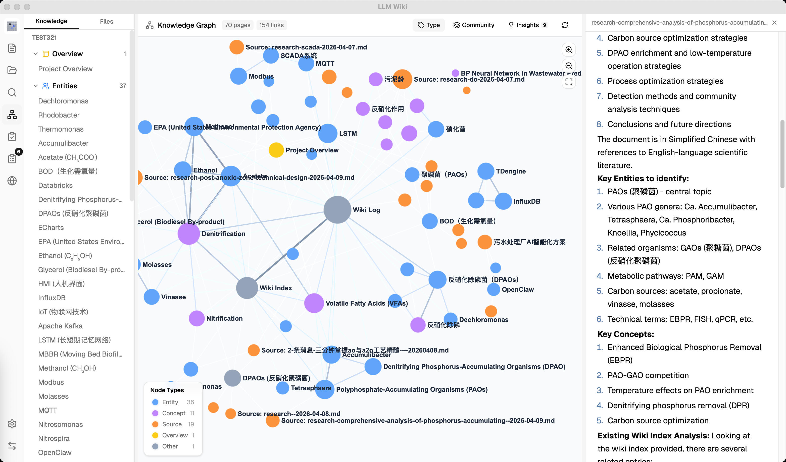

# LLM Wiki

<p align="center">
  
</p>

<p align="center">
  <strong>自分で育つパーソナル知識ベース。</strong><br>
  LLM が文書を読み、構造化された Wiki を作成し、継続的に更新します。
</p>

<p align="center">
  <a href="#これは何ですか">これは何ですか？</a> •
  <a href="#主な機能">主な機能</a> •
  <a href="#技術スタック">技術スタック</a> •
  <a href="#インストール">インストール</a> •
  <a href="#クレジット">クレジット</a> •
  <a href="#ライセンス">ライセンス</a>
</p>

<p align="center">
  <a href="README.md">English</a> | <a href="README_CN.md">中文</a> | 日本語
</p>

---

<p align="center">
  
</p>

## 主な機能

- **2 段階 Ingest**: LLM がまず分析し、その後 source traceability 付きの Wiki ページを生成します。
- **マルチモーダル画像 Ingest**: PDF などから埋め込み画像を抽出し、Vision LLM で事実ベースのキャプションを生成します。
- **4 シグナル知識グラフ**: 直接リンク、source overlap、Adamic-Adar、type affinity による関連度モデル。
- **Louvain コミュニティ検出**: 知識クラスタを自動検出し、凝集度を評価します。
- **Graph Insights**: 意外な接続や知識ギャップを検出し、Deep Research を開始できます。
- **ベクトル意味検索**: LanceDB ベースの任意の OpenAI-compatible embedding endpoint を利用できます。
- **永続 Ingest Queue**: 直列処理、クラッシュ復旧、キャンセル、リトライ、進捗表示に対応します。
- **フォルダインポート**: ディレクトリ構造を保った再帰インポートと、フォルダ文脈による分類ヒント。
- **Source フォルダ Auto-Watch**: `raw/sources/` の外部変更を検出し、ingest/delete cleanup と同期します。
- **Deep Research**: Tavily、SerpApi、SearXNG を使った複数クエリ検索と、結果の自動 Wiki 化。
- **非同期 Review System**: LLM が判断待ち項目を作成し、ユーザーが後から確認できます。
- **Chrome Web Clipper**: Web ページをワンクリップで取り込み、知識ベースへ自動 ingest します。

## これは何ですか？

LLM Wiki は、手元の文書を整理された相互リンク付きの知識ベースへ変換するクロスプラットフォームのデスクトップアプリです。従来の RAG のように毎回ゼロから検索して回答するのではなく、LLM が文書から**永続的な Wiki を増分的に構築・維持**します。

このプロジェクトは [Andrej Karpathy の LLM Wiki pattern](https://gist.github.com/karpathy/442a6bf555914893e9891c11519de94f) に基づいています。抽象的な設計パターンを、実際に使えるデスクトップアプリとして実装し、多数の拡張を加えています。

<p align="center">
  
</p>

## クレジット

基礎となる方法論は **Andrej Karpathy** の [llm-wiki.md](https://gist.github.com/karpathy/442a6bf555914893e9891c11519de94f) です。本プロジェクトは、その設計を具体的なアプリケーションとして実装したものです。

## 主な設計

### 1. 3 層アーキテクチャ

- **Raw Sources**: インポートした元資料。
- **Wiki**: LLM が生成する構造化ページ。
- **Schema / Purpose**: Wiki の構造ルールと目的。

生成される Wiki は `[[wikilink]]`、YAML frontmatter、`index.md`、`log.md` を使い、Obsidian vault としても扱えます。

### 2. 2 段階 Ingest

```
Step 1: Analysis
  - 主要な entity / concept / argument を抽出
  - 既存 Wiki との関連や矛盾を分析
  - Wiki 構造の提案を作成

Step 2: Generation
  - source summary、entity、concept ページを生成
  - index.md、log.md、overview.md を更新
  - Review item と Deep Research 用クエリを生成
```

追加機能:

- **SHA256 incremental cache**: 未変更の source は自動スキップ。
- **Persistent ingest queue**: アプリ再起動後も queue を復元。
- **Source folder auto-watch**: アプリ外で `raw/sources/` に追加・変更・削除されたファイルを検出し、同じ ingest/delete lifecycle で処理します。
- **Progressive Sources view**: 大きな source フォルダでも、スクロールに合わせて段階的に表示します。
- **Source traceability**: 生成ページは frontmatter の `sources: []` で元資料に紐づきます。

### 3. Knowledge Graph

知識グラフは sigma.js / graphology / ForceAtlas2 で描画されます。

| Signal | Weight | Description |
|--------|--------|-------------|
| Direct link | ×3.0 | `[[wikilink]]` による直接リンク |
| Source overlap | ×4.0 | 同じ raw source を共有するページ |
| Adamic-Adar | ×1.5 | 共通近傍による関連性 |
| Type affinity | ×1.0 | 同じ page type への加点 |

Graph Insights は、意外な関連、孤立ページ、弱いコミュニティ、bridge node を検出し、必要に応じて Deep Research を開始できます。

### 4. Search / Retrieval

- Tokenized search は `wiki/` と `raw/sources/` を検索します。
- 任意で embedding と LanceDB による vector semantic search を有効化できます。
- 検索結果は知識グラフで拡張され、context budget に収まるよう優先順位付けされます。

### 5. Deep Research

Deep Research は、LLM が search topic と複数の search query を生成し、Web 検索結果を統合して Wiki ページとして保存します。

対応 provider:

- **Tavily**: 汎用 Web search。
- **SerpApi**: Google、News、Scholar、Images、Videos、YouTube などの engine を選択可能。
- **SearXNG**: 自前または利用可能な SearXNG instance URL と categories を設定して検索。

### 6. Deletion / Cleanup

source を削除すると、関連する source summary、`sources[]`、`index.md`、本文の `[[wikilink]]`、`related:` 参照が整理されます。複数 source に共有されている entity / concept ページは、ページ自体を消さずに削除された source だけを外します。

## 技術スタック

| Layer | Technology |
|-------|------------|
| Desktop | Tauri v2 (Rust backend) |
| Frontend | React 19 + TypeScript + Vite |
| UI | shadcn/ui + Tailwind CSS v4 |
| Editor | Milkdown |
| Graph | sigma.js + graphology + ForceAtlas2 |
| Search | Tokenized search + graph relevance + optional LanceDB vector search |
| Vector DB | LanceDB |
| PDF | pdf-extract |
| Office | docx-rs + calamine |
| i18n | react-i18next |
| State | Zustand |
| LLM | Streaming fetch (OpenAI, Anthropic, Google, Ollama, Custom) |
| Web Search | Tavily, SerpApi, SearXNG JSON API |

## インストール

### ビルド済みバイナリ

[Releases](https://github.com/nashsu/llm_wiki/releases) からダウンロードできます。

- **macOS**: `.dmg` (Apple Silicon + Intel)
- **Windows**: `.msi`
- **Linux**: `.deb` / `.AppImage`

### ソースからビルド

```bash
# Requirements: Node.js 20+, Rust 1.70+
git clone https://github.com/nashsu/llm_wiki.git
cd llm_wiki
npm install
npm run tauri dev      # Development
npm run tauri build    # Production build
```

### Chrome Extension

1. `chrome://extensions` を開く
2. Developer mode を有効にする
3. Load unpacked をクリック
4. `extension/` ディレクトリを選択

## クイックスタート

1. アプリを起動し、新しい project を作成します。
2. **Settings** で LLM provider、API key、model を設定します。
3. 必要に応じて **Web Search** provider と source folder auto-watch を設定します。
4. **Sources** から PDF、DOCX、Markdown などをインポートします。
5. **Activity Panel** で Wiki ページ生成の進捗を確認します。
6. **Chat** で知識ベースに質問します。
7. **Knowledge Graph** で関連を探索します。
8. **Review** と **Lint** で Wiki の品質を保ちます。

## Project Structure

```
my-wiki/
├── purpose.md              # 目的、問い、研究範囲
├── schema.md               # Wiki 構造ルール
├── raw/
│   ├── sources/            # 元資料
│   └── assets/             # ローカル画像
├── wiki/
│   ├── index.md            # コンテンツ目録
│   ├── log.md              # 操作履歴
│   ├── overview.md         # 全体概要
│   ├── entities/           # 人物、組織、製品など
│   ├── concepts/           # 理論、手法、概念
│   ├── sources/            # source summary
│   ├── queries/            # 保存した chat / research
│   ├── synthesis/          # 横断的な分析
│   └── comparisons/        # 比較ページ
├── .obsidian/              # Obsidian vault 設定
└── .llm-wiki/              # アプリ設定、chat history、review items
```

## ライセンス

このプロジェクトは **GNU General Public License v3.0** でライセンスされています。詳細は [LICENSE](LICENSE) を参照してください。
