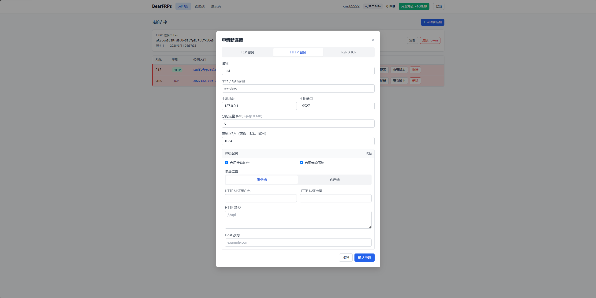
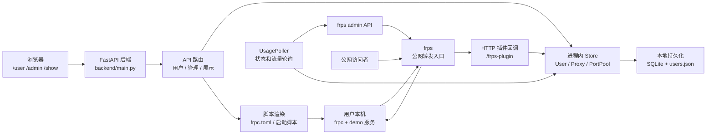

# BearFrps


BearFrps 是一个基于 frp/frps 的多用户动态连接管理平台。平台提供用户端、管理端和公网展示页，用户可以自助申请 frpc 配置和启动脚本，管理员可以查看连接、端口池和用户状态。

- 作者：BearFrps课程设计小组
- 课程：武汉大学开源软件与技术课程 2026
- Git 仓库地址：<https://github.com/Muleizhang/BearFrps.git>
- 许可证：Apache License 2.0

## 功能概览

- 用户注册、登录、余额充值和 frpc 专属令牌轮换。
- TCP、HTTP、XTCP 代理配置生成，XTCP 同时生成 stcp fallback 和 visitor 配置。
- 自动分配公网端口，支持 TCP 单端口、连续端口和自动端口模式。
- frps 插件回调校验用户令牌、代理归属、端口和轮换版本。
- 管理端查看用户、代理和端口池，支持启停和删除连接。
- 公网展示页聚合在线 demo 服务入口。

## 界面预览



## 架构总览



## 快速启动

```bash
python -m venv .venv
. .venv/bin/activate
pip install -r requirements.txt
python -m uvicorn backend.main:app --host 127.0.0.1 --port 8000
```

打开以下页面：

- 用户端：<http://127.0.0.1:8000/user>
- 管理端：<http://127.0.0.1:8000/admin>
- 展示页：<http://127.0.0.1:8000/show>

实际部署时还需要启动 frps。`frps/start.sh` 会按 `frps/frps.toml` 启动本地 frps，并让 frps 插件回调后端 `/frps-plugin`。

## 配置说明

核心配置由环境变量控制，默认值在 `backend/config.py` 中集中定义。常用项包括：

| 配置项 | 说明 |
| --- | --- |
| `SERVER_PUBLIC_HOST` | 展示给用户的公网地址 |
| `BACKEND_PORT` | FastAPI 后端端口 |
| `FRPS_BIND_PORT` | frps 控制端口 |
| `FRPS_ADMIN_API_URL` | frps 管理 API 地址 |
| `FRPS_AUTH_TOKEN` | frps 内部认证令牌 |
| `ALLOCATABLE_PORT_RANGE_START` / `ALLOCATABLE_PORT_RANGE_END` | 可分配公网 TCP 端口池 |
| `FREE_RECHARGE_AMOUNT_MB` | 免费充值流量 |
| `MAX_CONNECTIONS_PER_USER` | 单用户最大连接数 |

## 项目文档

- [全局完整文档](docs/global_document.md)：汇总项目背景、项目分工、架构、接口、运行方式、测试、Doxygen 注释规范、文档生成、许可证和开源合规。
- [口头报告与演示提纲](docs/oral_report.md)：整理课堂报告和现场演示的讲解顺序。
- Doxygen HTML 文档：运行 `./tools/generate_doxygen.sh` 后打开 `docs/doxygen/html/index.html`。

## 开源合规

BearFrps 根项目采用 Apache License 2.0。frp 和 frp-Android 也使用 Apache License 2.0，许可证兼容。第三方组件和许可证记录见 `SBOM.json` 和 `NOTICE`。

修改 `frp-Android/` 中的上游源码时，保留原许可证和版权声明，在修改文件中添加清晰的修改说明，并同步更新 `NOTICE` 与合规审计记录。

## 测试

```bash
.venv/bin/python -m pytest -q
node --check frontend/mock_api.js
.venv/bin/python tools/check_comment_ratio.py
git diff --check
```

## 注释规范

源码文件头参考 Doxygen 规范，使用 `@file`、`@brief`、`@author`、`@course`、`@date`、`@version`、`@copyright` 和 `@details` 标记。作者统一为 `BearFrps课程设计小组`，课程统一为 `武汉大学开源软件与技术课程 2026`。

## Doxygen 文档

项目提供 `Doxyfile`。本机安装 Doxygen 和 Graphviz 后，可以生成 HTML API 文档：

```bash
./tools/generate_doxygen.sh
```

生成结果位于 `docs/doxygen/html/index.html`。`docs/doxygen/` 已加入 `.gitignore`，需要浏览时在本地重新生成即可。
