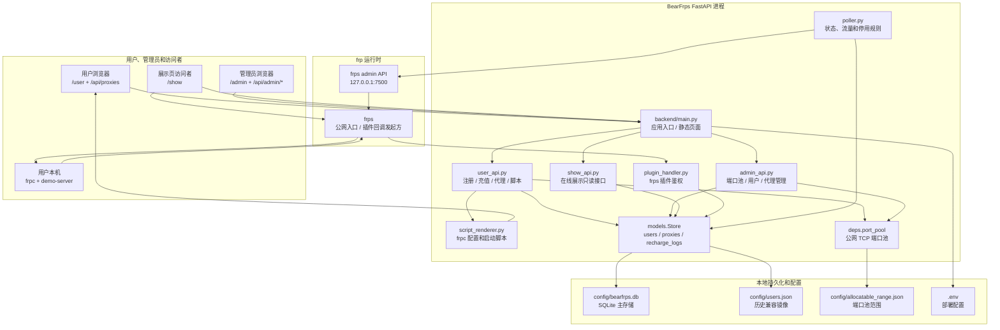
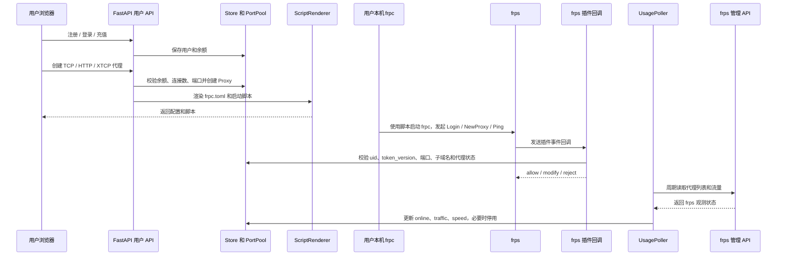

# BearFrps 全局完整文档

作者：BearFrps课程设计小组  
课程：武汉大学开源软件与技术课程 2026  
Git 仓库地址：<https://github.com/Muleizhang/BearFrps.git>  
许可证：Apache License 2.0  
版本：v1.0  
日期：2026-06-10

## 1. 项目概述

BearFrps 是一个基于 frp/frps 的多用户动态连接管理平台。项目把 frps、后端 API、用户端、管理端和公网展示页集中到同一套服务中，解决多人共享 frp 服务时的连接申请、端口分配、配置交付、在线状态展示和管理员控制问题。

核心流程如下：

1. 用户注册或登录。
2. 用户领取演示流量。
3. 用户创建 TCP、HTTP 或 XTCP 代理。
4. 后端分配端口、生成 frpc 配置和启动脚本。
5. 用户本地运行 frpc 和 demo 留言板服务。
6. frps 插件回调后端完成认证和代理参数校验。
7. 管理端和展示页查看代理在线状态。

## 2. 功能清单

| 模块 | 功能 |
| --- | --- |
| 用户端 | 注册、登录、退出、充值、frpc token 查询与轮换、代理创建、脚本复制和下载 |
| 管理端 | 管理员登录、端口池查看与修改、代理列表、用户列表、代理启停和删除 |
| 展示页 | 聚合展示 active 且 online 的用户 demo 服务 |
| frps 插件 | 处理 Login、NewProxy、Ping、CloseProxy 事件，校验用户令牌和代理归属 |
| 轮询器 | 读取 frps admin API，更新在线状态、流量、速度和停用条件 |
| 脚本渲染 | 输出 frpc.toml、visitor 配置、Linux/macOS/Windows 启动脚本 |
| demo 服务 | 提供 Python 和 Go 两个版本的本地留言板服务 |

## 3. 项目分工

整体需求对齐、功能边界和演示流程由三位小组成员共同讨论确定。以下分工根据 Git 提交记录和模块改动范围概括，实际开发中包含多轮交叉联调和共同修正。

| 成员 | 主要分工 |
| --- | --- |
| 张沐雷 | 负责组织工作、BearFRP前端、跨端联调、持续集成 CI、桌面端测试/自动化相关，参与端口、脚本、公网访问相关集成、演示场景设计和问题定位。 |
| 陈明德 | 负责 demo 服务、数据持久化、连接管理优化、测试和最终文档整理，参与前后端协同和 bug 修复。 |
| 郭一言 | 负责后端主体、用户与代理核心能力、frps 插件对接、合规和接口文档补充，参与接口联调和测试完善。 |

## 4. 系统结构

### 4.1 总体架构图



### 4.2 代理创建与运行时数据流



### 4.3 模块目录

| 层次 | 主要文件 | 说明 |
| --- | --- | --- |
| 应用入口 | `backend/main.py` | 创建 FastAPI 应用，注册路由，管理启动和关闭 |
| 配置 | `backend/config.py`、`backend/deps.py` | 集中管理环境变量、端口池和共享依赖 |
| 数据模型 | `backend/models.py` | 定义 User、Proxy、TcpMapping、RechargeLog 和 Store |
| 用户 API | `backend/routes/user_api.py` | 普通用户接口 |
| 管理 API | `backend/routes/admin_api.py` | 管理员接口 |
| 展示 API | `backend/routes/show_api.py` | 展示页只读接口 |
| frps 插件 | `backend/plugin_handler.py` | frps 事件回调鉴权 |
| frps 客户端 | `backend/frps_client.py` | 访问 frps admin API |
| 流量轮询 | `backend/poller.py` | 更新在线状态和用量 |
| 脚本生成 | `backend/script_renderer.py` | 渲染 frpc 配置和启动脚本 |
| 前端 | `frontend/*.html`、`frontend/shared.css`、`frontend/mock_api.js` | 用户端、管理端、展示页和离线 mock |
| demo 服务 | `demo-server/` | 用户本地留言板服务 |
| 测试 | `tests/` | API、插件、轮询器和端口池测试 |

### 4.4 用户端配置界面示例

下图展示用户端申请 HTTP 连接时的配置弹窗，覆盖代理名称、子域名前缀、本地地址、本地端口、流量额度、限速和高级配置等主要输入项。


## 5. 关键设计

### 5.1 多租户认证

frp v0.58.1 要求 frpc 的 `auth.token` 与 frps 的 `auth.token` 匹配，因此 BearFrps 把 frps 内部认证令牌和用户级令牌分离：

- `auth.token`：frps 内部共享认证令牌。
- `metadatas.token`：用户级 frpc token。
- `metadatas.uid`：用户 uid。
- `metas.token_version`：Login 成功后由插件写入，用于令牌轮换后拒绝旧配置。

### 5.2 端口池

平台分配 frps 的公网 `remotePort`，用户机器上的 `localPort` 由用户本地服务决定。TCP 代理支持三种模式：

- `auto`：自动分配连续 remotePort。
- `single`：用户指定单个 remotePort。
- `range`：用户指定连续 remotePort 范围。

管理员可以调整可分配端口池。缩小端口池时，后端会拒绝会导致现有 active TCP 代理越界的配置。

### 5.3 流量和停用

轮询器定期读取 frps admin API，统计代理累计流量和当前速度。以下情况会停用代理：

- 单个代理用量达到分配流量上限。
- 用户余额小于等于 0。
- 管理员手动停用代理。

停用代理会保留端口，删除代理时释放端口。

### 5.4 frp-Android 处理策略

`frp-Android/` 是第三方 Apache-2.0 开源移动端 frp 项目。当前仓库把它作为移动端适配组件记录在 `NOTICE` 和 `SBOM.json` 中，未改动其上游源码。移动端适配或上游源码修改遵循以下规则：

- 保留上游 `LICENSE` 和版权声明。
- 修改过的文件使用 Doxygen 风格注释标明修改者、课程和修改内容。
- 同步更新 `NOTICE`、`SBOM.json` 和本全局文档。

## 6. API 摘要

### 6.1 用户接口

| 方法 | 路径 | 说明 |
| --- | --- | --- |
| `POST` | `/api/user/register` | 注册用户 |
| `POST` | `/api/user/login` | 登录用户 |
| `POST` | `/api/user/logout` | 退出登录 |
| `GET` | `/api/user/me` | 获取当前用户信息 |
| `POST` | `/api/user/recharge` | 免费充值演示流量 |
| `GET` | `/api/user/frpc-token` | 获取 frpc token |
| `POST` | `/api/user/frpc-token/rotate` | 轮换 frpc token |
| `GET` | `/api/proxies` | 获取当前用户代理 |
| `POST` | `/api/proxies` | 创建代理 |
| `GET` | `/api/proxies/{id}/scripts` | 重新获取配置和脚本 |
| `DELETE` | `/api/proxies/{id}` | 删除代理 |

### 6.2 管理和展示接口

| 方法 | 路径 | 说明 |
| --- | --- | --- |
| `POST` | `/api/admin/login` | 管理员登录 |
| `POST` | `/api/admin/logout` | 管理员退出 |
| `GET` | `/api/admin/config` | 获取端口池配置 |
| `PUT` | `/api/admin/config` | 修改端口池配置 |
| `GET` | `/api/admin/proxies` | 获取全量代理 |
| `POST` | `/api/admin/proxies/{id}/stop` | 停用代理 |
| `POST` | `/api/admin/proxies/{id}/start` | 恢复代理 |
| `DELETE` | `/api/admin/proxies/{id}` | 删除代理 |
| `GET` | `/api/admin/users` | 获取用户列表 |
| `GET` | `/api/show/online` | 获取在线展示代理 |
| `POST` | `/frps-plugin` | frps 插件回调 |

## 7. 运行说明

### 7.1 安装依赖

```bash
python -m venv .venv
. .venv/bin/activate
pip install -r requirements.txt
```

### 7.2 启动后端

```bash
python -m uvicorn backend.main:app --host 127.0.0.1 --port 8000
```

访问地址：

- 用户端：<http://127.0.0.1:8000/user>
- 管理端：<http://127.0.0.1:8000/admin>
- 展示页：<http://127.0.0.1:8000/show>

### 7.3 启动 frps

```bash
bash frps/start.sh
```

部署时在 `.env` 中设置管理员密码、frps admin 密码和内部认证 token。

## 8. 测试与质量保证

质量检查命令如下：

```bash
.venv/bin/python -m pytest -q
node --check frontend/mock_api.js
python -m json.tool SBOM.json >/dev/null
.venv/bin/python tools/check_comment_ratio.py
git diff --check
```

最近一次验证结果：

```text
37 passed
SBOM.json ok
Comment ratio check passed
Doxygen HTML generated
```

## 9. Doxygen 注释规范

源码注释参考 Doxygen 标记，文件头使用以下字段：

```text
@file 文件路径
@brief 文件功能摘要
@author BearFrps课程设计小组
@course 武汉大学开源软件与技术课程 2026
@date 2026-06-10
@version 1.0
@copyright Apache-2.0
@details 模块职责、依赖关系、关键业务规则和副作用
```

函数或方法注释使用：

```text
@brief 功能摘要
@param 参数名 参数含义、取值范围或约束
@return 返回值含义
@throws 可能抛出的异常或 HTTP 错误
@note 副作用、并发要求或安全注意事项
```

注释关注接口、约束、原因、副作用和业务规则，不逐行复述代码。

本项目同时提供 `Doxyfile`。安装 Doxygen 和 Graphviz 后可运行：

```bash
./tools/generate_doxygen.sh
```

生成的 HTML 文档位于 `docs/doxygen/html/index.html`。生成目录已加入 `.gitignore`，需要浏览时在本地重新生成即可。

## 10. 开源合规

BearFrps 根项目采用 Apache License 2.0。该许可证与 frp 和 frp-Android 的 Apache License 2.0 兼容。第三方组件记录如下：

| 组件 | 许可证 | 用途 |
| --- | --- | --- |
| frp v0.58.1 | Apache-2.0 | frps/frpc 协议和插件集成 |
| frp-Android v1.3.2 | Apache-2.0 | 移动端 frp 客户端适配 |
| FastAPI、Pydantic、pytest 等 Python 依赖 | MIT/BSD 系列 | 后端和测试 |
| Tailwind CSS、Alpine.js | MIT | 前端页面 |

完整物料清单见 `SBOM.json`，开源声明见 `NOTICE`，许可证全文见 `LICENSE`。

## 11. 口头报告与演示安排

建议按功能链路展开演示：

1. 展示 Git 仓库地址和 README。
2. 说明许可证、NOTICE、SBOM 和 frp/frp-Android 兼容性。
3. 运行自动化测试。
4. 启动后端并打开 `/user`。
5. 注册用户、充值、创建代理并展示生成脚本。
6. 打开管理端，展示用户、代理和端口池。
7. 打开展示页，说明在线代理过滤规则。
8. 说明 Doxygen 注释规范、HTML 文档生成和 `tools/check_comment_ratio.py` 检查结果。

详细演示稿见 `docs/oral_report.md`。
