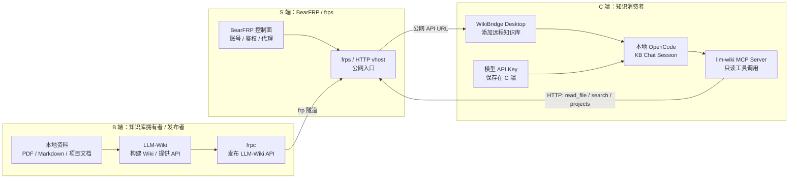
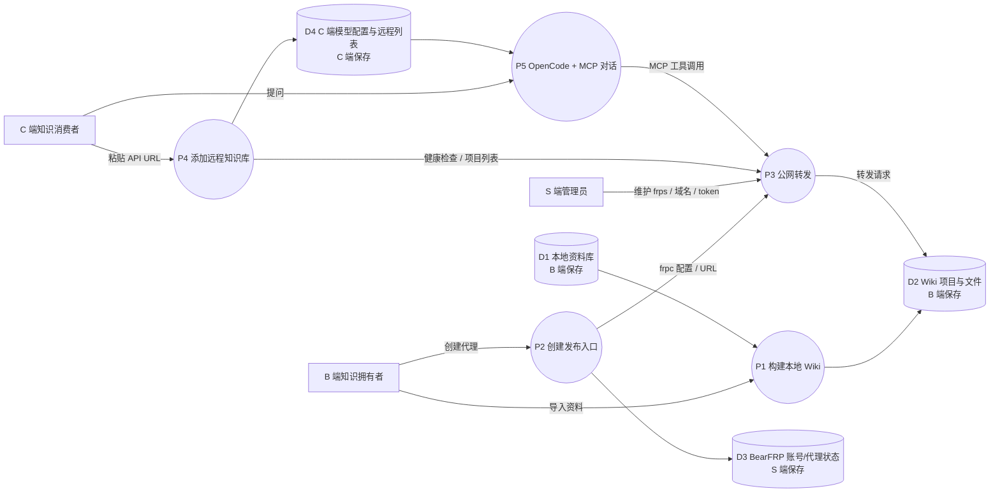
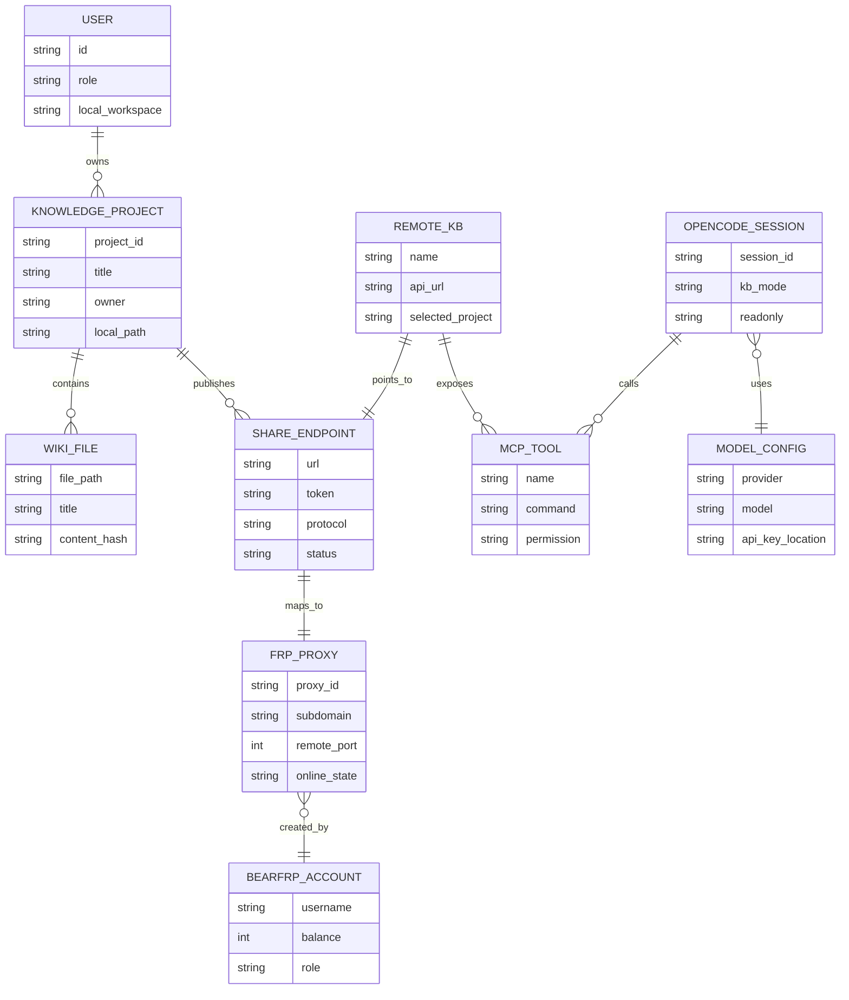
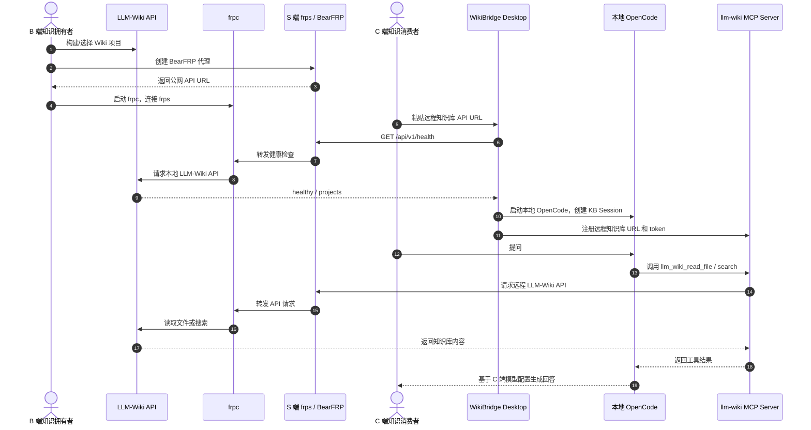
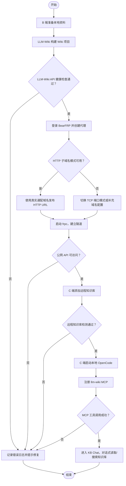
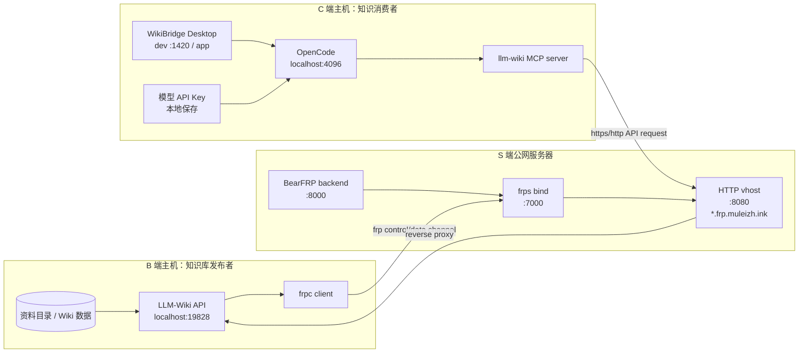

# WikiBridge 软件设计规格说明书图表素材

本文件暂存从《WikiBridge 可行性研究与项目开发计划书》中迁出的设计级图表。后续编写《软件设计规格说明书》时，可按章节拆分、精修并纳入正式 SDS。

## 当前总体架构图

```mermaid
flowchart LR
  subgraph B["B 端：知识库拥有者 / 发布者"]
    BData["本地资料<br/>PDF / Markdown / 项目文档"]
    BWiki["LLM-Wiki<br/>构建 Wiki / 提供 API"]
    BFrpc["frpc<br/>发布 LLM-Wiki API"]
    BData --> BWiki --> BFrpc
  end

  subgraph S["S 端：BearFRP / frps"]
    SControl["BearFRP 控制面<br/>账号 / 鉴权 / 代理"]
    SFrps["frps / HTTP vhost<br/>公网入口"]
    SControl --> SFrps
  end

  subgraph C["C 端：知识消费者"]
    CDesktop["WikiBridge Desktop<br/>添加远程知识库"]
    COpenCode["本地 OpenCode<br/>KB Chat Session"]
    CMcp["llm-wiki MCP Server<br/>只读工具调用"]
    CKey["模型 API Key<br/>保存在 C 端"]
    CDesktop --> COpenCode
    COpenCode --> CMcp
    CKey --> COpenCode
  end

  BFrpc -- "frp 隧道" --> SFrps
  SFrps -- "公网 API URL" --> CDesktop
  CMcp -- "HTTP: read_file / search / projects" --> SFrps
```

## 顶层数据流图

```mermaid
flowchart LR
  BUser["B 端知识拥有者"]
  CUser["C 端知识消费者"]
  Admin["S 端管理员"]

  P1(("P1 构建本地 Wiki"))
  P2(("P2 创建发布入口"))
  P3(("P3 公网转发"))
  P4(("P4 添加远程知识库"))
  P5(("P5 OpenCode + MCP 对话"))

  D1[("D1 本地资料库<br/>B 端保存")]
  D2[("D2 Wiki 项目与文件<br/>B 端保存")]
  D3[("D3 BearFRP 账号/代理状态<br/>S 端保存")]
  D4[("D4 C 端模型配置与远程列表<br/>C 端保存")]

  BUser -->|"导入资料"| P1
  D1 --> P1
  P1 --> D2
  BUser -->|"创建代理"| P2
  P2 --> D3
  P2 -->|"frpc 配置 / URL"| P3
  Admin -->|"维护 frps / 域名 / token"| P3
  CUser -->|"粘贴 API URL"| P4
  P4 --> D4
  P4 -->|"健康检查 / 项目列表"| P3
  CUser -->|"提问"| P5
  D4 --> P5
  P5 -->|"MCP 工具调用"| P3
  P3 -->|"转发请求"| D2
```

## 核心概念实体关系图

```mermaid
erDiagram
  USER ||--o{ KNOWLEDGE_PROJECT : owns
  KNOWLEDGE_PROJECT ||--o{ WIKI_FILE : contains
  KNOWLEDGE_PROJECT ||--o{ SHARE_ENDPOINT : publishes
  SHARE_ENDPOINT ||--|| FRP_PROXY : maps_to
  FRP_PROXY }o--|| BEARFRP_ACCOUNT : created_by
  REMOTE_KB ||--|| SHARE_ENDPOINT : points_to
  REMOTE_KB ||--o{ MCP_TOOL : exposes
  OPENCODE_SESSION ||--o{ MCP_TOOL : calls
  OPENCODE_SESSION }o--|| MODEL_CONFIG : uses

  USER {
    string id
    string role
    string local_workspace
  }

  KNOWLEDGE_PROJECT {
    string project_id
    string title
    string owner
    string local_path
  }

  WIKI_FILE {
    string file_path
    string title
    string content_hash
  }

  SHARE_ENDPOINT {
    string url
    string token
    string protocol
    string status
  }

  FRP_PROXY {
    string proxy_id
    string subdomain
    int remote_port
    string online_state
  }

  REMOTE_KB {
    string name
    string api_url
    string selected_project
  }

  MCP_TOOL {
    string name
    string command
    string permission
  }

  OPENCODE_SESSION {
    string session_id
    string kb_mode
    string readonly
  }

  MODEL_CONFIG {
    string provider
    string model
    string api_key_location
  }

  BEARFRP_ACCOUNT {
    string username
    int balance
    string role
  }
```

## 远程知识库访问时序图

```mermaid
sequenceDiagram
  autonumber
  actor B as B 端知识拥有者
  participant Wiki as LLM-Wiki API
  participant Frpc as frpc
  participant Frps as S 端 frps / BearFRP
  actor C as C 端知识消费者
  participant Desk as WikiBridge Desktop
  participant OC as 本地 OpenCode
  participant MCP as llm-wiki MCP Server

  B->>Wiki: 构建/选择 Wiki 项目
  B->>Frps: 创建 BearFRP 代理
  Frps-->>B: 返回公网 API URL
  B->>Frpc: 启动 frpc，连接 frps
  C->>Desk: 粘贴远程知识库 API URL
  Desk->>Frps: GET /api/v1/health
  Frps->>Frpc: 转发健康检查
  Frpc->>Wiki: 请求本地 LLM-Wiki API
  Wiki-->>Desk: healthy / projects
  Desk->>OC: 启动本地 OpenCode，创建 KB Session
  Desk->>MCP: 注册远程知识库 URL 和 token
  C->>OC: 提问
  OC->>MCP: 调用 llm_wiki_read_file / search
  MCP->>Frps: 请求远程 LLM-Wiki API
  Frps->>Frpc: 转发 API 请求
  Frpc->>Wiki: 读取文件或搜索
  Wiki-->>MCP: 返回知识库内容
  MCP-->>OC: 返回工具结果
  OC-->>C: 基于 C 端模型配置生成回答
```

## 端到端发布与访问活动图

```mermaid
flowchart TD
  Start([开始])
  A["B 端准备本地资料"]
  B["LLM-Wiki 构建 Wiki 项目"]
  C{"LLM-Wiki API 健康检查通过？"}
  D["登录 BearFRP 并创建代理"]
  E{"HTTP 子域名模式可用？"}
  F["使用真实通配域名发布 HTTP URL"]
  G["切换 TCP 端口模式或补充域名配置"]
  H["启动 frpc，建立隧道"]
  I{"公网 API 可访问？"}
  J["C 端添加远程知识库"]
  K{"远程知识库检测通过？"}
  L["C 端启动本地 OpenCode"]
  M["注册 llm-wiki MCP"]
  N{"MCP 工具调用成功？"}
  O["进入 KB Chat，对话式读取/搜索知识库"]
  P["记录错误日志并提示修复"]
  End([结束])

  Start --> A --> B --> C
  C -- 否 --> P --> End
  C -- 是 --> D --> E
  E -- 是 --> F --> H
  E -- 否 --> G --> H
  H --> I
  I -- 否 --> P
  I -- 是 --> J --> K
  K -- 否 --> P
  K -- 是 --> L --> M --> N
  N -- 否 --> P
  N -- 是 --> O --> End
```

## 部署拓扑图

```mermaid
flowchart LR
  subgraph BHost["B 端主机：知识库发布者"]
    BFiles[("资料目录 / Wiki 数据")]
    BApi["LLM-Wiki API<br/>localhost:19828"]
    BFrpc["frpc client"]
    BFiles --> BApi --> BFrpc
  end

  subgraph SHost["S 端公网服务器"]
    Bear["BearFRP backend<br/>:8000"]
    FrpsBind["frps bind<br/>:7000"]
    HttpVhost["HTTP vhost<br/>:8080<br/>*.frp.muleizh.ink"]
    Bear --> FrpsBind
    FrpsBind --> HttpVhost
  end

  subgraph CHost["C 端主机：知识消费者"]
    Desktop["WikiBridge Desktop<br/>dev :1420 / app"]
    OpenCode["OpenCode<br/>localhost:4096"]
    Mcp["llm-wiki MCP server"]
    Model["模型 API Key<br/>本地保存"]
    Desktop --> OpenCode --> Mcp
    Model --> OpenCode
  end

  BFrpc -- "frp control/data channel" --> FrpsBind
  Mcp -- "https/http API request" --> HttpVhost
  HttpVhost -- "reverse proxy" --> BApi
```
