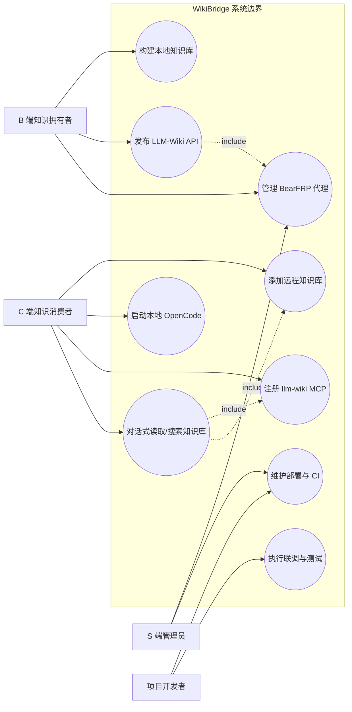
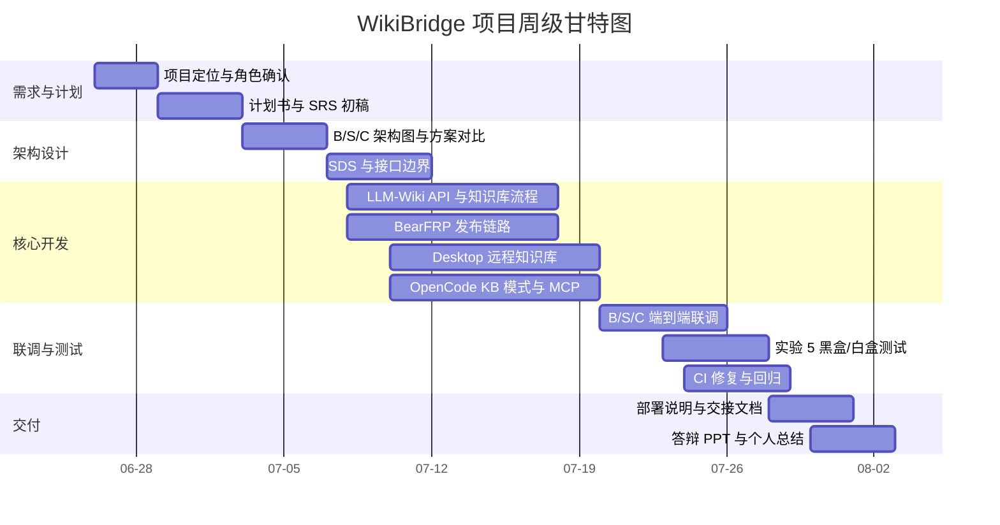

# WikiBridge 可行性研究与项目开发计划书

## 封面信息

| 项目 | 内容 |
| --- | --- |
| 项目名称 | WikiBridge 零代码内网穿透本地知识库平台 |
| 项目代号 | WikiBridge |
| 文档类型 | 可行性研究与项目开发计划书 |
| 文档版本 | v0.3 |
| 编写日期 | 2026 年 6 月 26 日 |
| 项目周期 | 待组内确认 |
| 编写单位 | WikiBridge 项目组（武汉大学软件工程课程设计项目组） |

## 文档说明

### 修订历史

| 版本 | 日期 | 主要变更 |
| --- | --- | --- |
| v0.1 | 2026-06-01 | 启动项目选题与可行性分析，形成问题背景、项目目标、初始范围和本地知识库分享场景 |
| v0.2 | 2026-06-10 | 补充 B 端、S 端、C 端角色、核心功能、投入收益、风险和项目开发计划草案 |
| v0.3 | 2026-06-18 | 补充计划书级用例图、架构图、WBS、甘特图和交付物清单，形成计划任务书主体 |
| v0.4 | 2026-06-25 | 根据 MCP 架构调整收敛方案：淘汰“B 端发布完整 OpenCode”，明确 B 端只发布 LLM-Wiki API，C 端本地 OpenCode + MCP 消费远程知识库 |
| v1.0 | 2026-06-26 | 收敛计划任务书图表边界，保留用例、架构演进、WBS 和甘特图，并按正式提交口径整理全文 |

### 文档约定

- 本文档同时承担《可行性研究报告》与《项目开发计划》两份文档职责，结构参考 GB/T 8567-88 与 GB/T 856T-88，并结合课程项目实际进行裁剪。
- 文档面向课程指导教师、项目组成员、验收评委和后续维护者。
- 文档中的人员分工、项目周期、里程碑日期、正式需求编号等内容仍需组内最终确认。
- 本文档采用当前联调后确定的最终架构：B 端发布 LLM-Wiki API，S 端提供 BearFRP/frps 控制面和公网入口，C 端本地运行 OpenCode 并通过 MCP 访问远程知识库。

## 1 引言

### 1.1 编写目的

本文档的目的有三点：

1. 从技术、经济、法律合规、运行和操作等角度论证 WikiBridge 项目的可行性，为课程项目立项和后续开发提供依据。
2. 明确项目目标、范围边界、核心需求和关键架构决策，作为后续需求规格说明书、软件设计规格说明书和测试文档的输入。
3. 给出项目工作分解、人员组织、进度安排、交付物和风险应对计划，便于项目组执行、跟踪和复盘。

### 1.2 项目背景

个人和小团队在学习、科研、课程设计、项目协作中会积累大量本地资料，例如 PDF、Markdown、网页剪藏、课堂笔记、研究记录和项目文档。这些资料通常分散在本地文件夹和不同工具中，难以沉淀为可浏览、可检索、可问答的知识库。

现有知识库方案通常存在两类门槛：

- 部署门槛高：用户需要理解后端服务、向量数据库、模型 API、网页托管和公网访问配置。
- 分享边界不清：将资料上传到云端平台虽然方便，但对一些课程资料、科研资料或未公开项目资料并不合适；本地保存虽然安全，但很难临时分享给同学、老师或小组成员访问。

WikiBridge 的核心目标是让知识拥有者在本地生成和持有知识库，并通过受控公网入口分享给特定访客。项目不是公共博客平台，也不是云端全量搜索引擎，而是面向“本地知识库生成 + 有限共享 + Agent 化消费”的课程项目原型。

### 1.3 项目相关方

| 相关方 | 角色描述 |
| --- | --- |
| 项目提出者 | WikiBridge 项目组 |
| 开发者 | WikiBridge 项目组，共 6 人，具体分工待组内最终确认 |
| B 端用户 | 知识库拥有者和发布者，负责本地资料整理、Wiki 构建和分享入口创建 |
| S 端服务 | BearFRP 控制面和 frps 公网转发层，负责账号、鉴权、子域名/端口和隧道状态 |
| C 端用户 | 知识消费者或受限访客，通过本地 OpenCode + MCP 访问 B 端分享的知识库 API |
| 外部依赖 | frp/frpc/frps、OpenCode、LLM-Wiki、模型 API、Docker Compose、GitHub Actions |

### 1.4 与其他系统的关系

WikiBridge 不是从零实现所有能力，而是集成和改造多个现有组件：

- LLM-Wiki：负责本地资料编译、Wiki 页面生成、项目和文件 API。
- OpenCode：作为 C 端本地知识消费和对话式访问入口。
- MCP server：将 B 端分享的 LLM-Wiki API 注册为 C 端 OpenCode 可调用的工具。
- BearFRP/frp：负责把 B 端本地 LLM-Wiki API 通过公网入口发布给 C 端。
- WikiBridge Desktop：负责统一桌面端操作、远程知识库添加、本地 OpenCode 启动和 MCP 注册。

### 1.5 术语与缩写

| 术语 | 含义 |
| --- | --- |
| B 端 | 知识库拥有者/发布者所在环境，保存本地资料和 Wiki 内容 |
| S 端 | 公网服务器端，运行 BearFRP 控制面和 frps |
| C 端 | 知识消费者/受限访客所在环境，本地运行 OpenCode |
| LLM-Wiki | 本地知识库编译与 API 服务，提供项目、文件、搜索等能力 |
| OpenCode | C 端本地知识消费与对话界面 |
| MCP | Model Context Protocol，用于将 LLM-Wiki 能力接入 OpenCode |
| BearFRP | 本项目中的 frp 控制面，负责账号、代理、流量和发布入口 |
| frpc/frps | frp 客户端/服务端，用于内网穿透和公网访问转发 |
| KB 模式 | OpenCode 的知识库模式，限制文件访问和工具能力范围 |
| API 分享 | B 端通过 BearFRP 分享 LLM-Wiki API，而不是分享完整 OpenCode 页面 |

### 1.6 参考资料

- GB/T 8567-88《计算机软件开发文件编制指南》
- GB/T 856T-88《项目开发计划编写规范》
- frp 官方项目：https://github.com/fatedier/frp
- OpenCode 项目资料与本项目集成代码
- LLM-Wiki 项目资料与本项目集成代码
- `/root/SE/wikibridge/README.deploy.md`
- `/root/SE/wikibridge/desktop/HANDOFF.md`
- `/root/SE/doc/images/architecture/old_b_side_opencode.png`
- `/root/SE/doc/images/architecture/new_c_side_mcp.png`

## 2 项目概述

### 2.1 产品定位

WikiBridge 定位为“本地优先的知识库生成与有限共享工具”。其核心命题是：

> 让知识拥有者在本地生成和持有 Wiki，通过 BearFRP 发布受控 API，再由 C 端本地 OpenCode + MCP 进行对话式知识消费。

项目差异化定位包括：

- 本地优先：原始资料、Wiki 页面和主要知识内容保留在 B 端本地。
- 有限共享：B 端主动分享访问入口，C 端作为受限访客访问指定知识库。
- 受控 Agent 化消费：OpenCode 不运行在 B 端公网暴露环境，而是在 C 端本地运行，通过 MCP 访问 B 端分享的 LLM-Wiki API。
- 低部署门槛：用户不需要手写 frp 配置和复杂网络脚本，系统负责生成和连接发布入口。

### 2.2 范围与边界

#### 2.2.1 In-Scope

- 本地资料管理和 Wiki 构建流程。
- LLM-Wiki 项目、文件、搜索和健康检查 API。
- BearFRP 用户注册、登录、充值、代理创建、脚本生成、HTTP/TCP 发布入口。
- B 端通过 BearFRP 发布 LLM-Wiki API。
- C 端桌面端添加远程知识库 API 地址。
- C 端本地启动 OpenCode，并注册 `llm-wiki-*` MCP。
- OpenCode KB 模式下只读访问、MCP 白名单和基本安全边界控制。
- Docker Compose 一键集成部署和基本演示链路。
- 基础测试、系统 mock、CI 回归和课程验收文档。

#### 2.2.2 Out-of-Scope

- 面向全网的公开博客、CDN 分发和搜索引擎收录。
- 云端托管用户原始资料、Wiki 正文或问答上下文。
- 大规模多租户商业运营、计费和 SLA。
- 移动端原生 App。
- 完整企业级权限体系、审计平台和内容审核流程。
- 真实支付、商业化订阅和长期运维。
- 对任意 OpenCode 工具能力的公网开放。

### 2.3 核心功能概览

| 功能模块 | 关键能力 |
| --- | --- |
| 本地知识库构建 | 导入资料、生成 Markdown Wiki、维护 Wiki 项目和文件 |
| LLM-Wiki API | 健康检查、项目列表、文件读取、搜索、图谱/元数据接口 |
| BearFRP 控制面 | 用户、余额、代理、子域名/端口、frpc 脚本、在线状态 |
| 发布链路 | B 端 LLM-Wiki API 经 frpc/frps 发布为公网 URL |
| C 端远程知识库 | 添加远程 API 地址、检测可用性、选择项目、保存 token |
| OpenCode + MCP | C 端本地 OpenCode 启动、MCP 注册、对话中调用远程知识库 |
| 安全边界 | KB 只读模式、`llm-wiki-*` MCP 白名单、禁止暴露 B 端完整 Agent |
| 部署与验证 | Docker Compose、健康检查、CI 测试、演示文档 |

### 2.4 项目可交付物

#### 2.4.1 程序

- WikiBridge Desktop 桌面端源码。
- LLM-Wiki 服务源码及知识库 API。
- BearFRP 控制面、frps/frpc 集成代码。
- OpenCode KB 模式与 MCP 接入相关修改。
- LLM-Wiki MCP server。
- Docker Compose 部署配置。
- GitHub Actions / CI 配置。
- 系统测试 mock 和测试用例。

#### 2.4.2 文档

- 《WikiBridge 可行性研究与项目开发计划书》（本文档）
- 《WikiBridge 需求规格说明书》（待补）
- 《WikiBridge 软件设计规格说明书》（待补）
- 《WikiBridge 测试文档/测试报告》（已有阶段性材料，后续继续补）
- 《WikiBridge 部署说明》
- 《WikiBridge Desktop 交接说明》
- 答辩 PPT、演示截图和项目总结材料

#### 2.4.3 服务与演示材料

- 本地 Docker Compose 演示栈。
- BearFRP 公网发布入口。
- C 端本地 OpenCode + MCP 远程知识库演示。
- 架构对比图：
  - 旧方案：`/root/SE/doc/images/architecture/old_b_side_opencode.png`
  - 新方案：`/root/SE/doc/images/architecture/new_c_side_mcp.png`

## 3 需求分析

### 3.1 用户角色与画像

| 角色 | 画像描述 |
| --- | --- |
| B 端知识拥有者 | 有本地课程资料、科研资料或项目资料，希望生成结构化 Wiki，并临时分享给同学、老师、导师或小组成员 |
| C 端知识消费者 | 被授权访问某个知识库的访客，希望浏览、搜索和对话式提问，但不应拥有 B 端本机权限 |
| S 端管理员 | 维护 BearFRP 控制面、frps、部署环境、端口/子域名和安全凭据 |
| 项目开发者 | 负责 LLM-Wiki、BearFRP、OpenCode/MCP、桌面端、测试与文档 |

### 3.2 用户用例图

下图给出 WikiBridge 计划阶段的顶层用例。它只表达各类参与者与核心业务目标之间的关系，不展开界面按钮和内部 API 细节。

图 3-1 WikiBridge 用户用例图

### 3.3 典型用例

#### UC-01 B 端构建本地知识库

| 项目 | 内容 |
| --- | --- |
| 主参与者 | B 端知识拥有者 |
| 前置条件 | 用户已准备本地资料，LLM-Wiki 服务可用 |
| 基本路径 | 添加资料 -> 触发构建 -> LLM-Wiki 生成 Markdown Wiki -> 本地可浏览 |
| 扩展路径 | 模型配置缺失时提示配置；构建失败时保留错误日志 |
| 后置条件 | 本地生成 Wiki 项目和页面 |

#### UC-02 B 端发布 LLM-Wiki API

| 项目 | 内容 |
| --- | --- |
| 主参与者 | B 端知识拥有者 |
| 前置条件 | BearFRP 可用，B 端 LLM-Wiki API 可访问 |
| 基本路径 | 登录 BearFRP -> 创建 HTTP/TCP 代理 -> 启动 frpc -> 获得公网 API URL |
| 扩展路径 | 通配域名未配置时提示使用 TCP 或配置真实域名；余额不足时拒绝创建 |
| 后置条件 | C 端可通过公网 URL 访问 B 端 LLM-Wiki API |

#### UC-03 C 端添加远程知识库

| 项目 | 内容 |
| --- | --- |
| 主参与者 | C 端知识消费者 |
| 前置条件 | C 端已安装/启动 WikiBridge Desktop，持有 B 端分享的 API URL |
| 基本路径 | 输入远程 API URL -> 检查 `/api/v1/health` 和项目列表 -> 保存远程知识库 |
| 扩展路径 | URL 不完整、服务不可达、token 错误时给出明确提示 |
| 后置条件 | 远程知识库进入 C 端列表，可选择项目 |

#### UC-04 C 端本地 OpenCode + MCP 对话

| 项目 | 内容 |
| --- | --- |
| 主参与者 | C 端知识消费者 |
| 前置条件 | C 端保存模型 API Key，远程知识库可访问 |
| 基本路径 | 启动本地 OpenCode -> 注册 `llm-wiki-*` MCP -> 创建 KB Chat Session -> 对话中读取/搜索远程知识库 |
| 扩展路径 | OpenCode 未就绪、MCP 注册失败、远程 API 401/403 时提示处理方式 |
| 后置条件 | C 端可通过本地 OpenCode 对 B 端知识库进行对话式消费 |

### 3.4 功能性需求 FR

| 编号 | 需求描述 | 优先级 |
| --- | --- | --- |
| FR-01 | 系统应支持 B 端将本地资料构建为 Markdown Wiki 项目 | P0 |
| FR-02 | 系统应提供 LLM-Wiki API，支持健康检查、项目列表、文件读取和搜索 | P0 |
| FR-03 | 系统应支持 BearFRP 创建 TCP/HTTP 发布代理，并生成可运行 frpc 配置或脚本 | P0 |
| FR-04 | 系统应支持 B 端发布 LLM-Wiki API 公网入口 | P0 |
| FR-05 | 系统应在 HTTP 子域名模式下依赖真实可解析通配域名，配置不满足时给出提示或降级建议 | P0 |
| FR-06 | C 端应能添加远程知识库 API URL，并检测服务可达性和项目列表 | P0 |
| FR-07 | C 端应能本地启动 OpenCode，并创建 KB Chat Session | P0 |
| FR-08 | C 端应能注册 `llm-wiki-*` MCP，使 OpenCode 能调用远程 LLM-Wiki API | P0 |
| FR-09 | OpenCode 在 KB 模式下应限制危险能力，只允许受控知识库访问 | P0 |
| FR-10 | 系统应支持远程知识库 token 配置，以访问受保护 API | P1 |
| FR-11 | 系统应提供 Docker Compose 集成部署和健康检查 | P1 |
| FR-12 | 系统应提供基本自动化测试和 CI 验证远程知识库流程 | P1 |
| FR-13 | 系统应提供交接说明、部署说明和验收演示材料 | P1 |

#### 3.4.1 需求追踪关系

| 需求编号 | 来源用例 | 验证方式 |
| --- | --- | --- |
| FR-01 | UC-01 | LLM-Wiki 构建流程测试、手工导入资料验证 |
| FR-02 | UC-01、UC-03、UC-04 | `/api/v1/health`、项目列表、文件读取和搜索接口测试 |
| FR-03 | UC-02 | BearFRP 代理创建、脚本生成和在线状态测试 |
| FR-04 | UC-02 | B/S/C 分布式联调，公网 URL 访问健康检查 |
| FR-05 | UC-02 | HTTP 子域名配置测试，未配置通配域名时验证错误提示 |
| FR-06 | UC-03 | Desktop 远程知识库添加 flow 系统测试 |
| FR-07 | UC-04 | OpenCode 启动和 KB Session 创建测试 |
| FR-08 | UC-04 | MCP 注册状态和工具调用测试 |
| FR-09 | UC-04 | KB 只读模式、MCP 白名单和危险能力阻断测试 |
| FR-10 | UC-03、UC-04 | token 配置、401/403 错误处理测试 |
| FR-11 | UC-02、UC-04 | Docker Compose 集成启动和健康检查 |
| FR-12 | UC-03、UC-04 | CI 中 desktop system tests 和 mock 回归 |
| FR-13 | 全部用例 | 文档审查、演示材料和交接检查 |

### 3.5 非功能性需求 NFR

#### 3.5.1 安全与隐私

- S 端不得保存用户原始资料、Wiki 正文或问答上下文。
- B 端不应通过 frp 暴露完整 OpenCode Agent 环境。
- C 端模型供应商、API Key 和模型名应保存在 C 端本地。
- OpenCode KB 模式应默认阻断危险文件访问、终端执行和不受控工具能力。
- MCP 接入应通过白名单限制，仅允许 WikiBridge LLM-Wiki MCP。

#### 3.5.2 可靠性

- B 端 API 发布后，C 端应能通过 `/api/v1/health` 进行健康检查。
- BearFRP 应能正确维护代理状态、子域名/端口和在线状态。
- 远程知识库不可达时，桌面端应给出明确错误提示，而不是静默失败。
- CI 应覆盖桌面端远程知识库 flow 的核心 mock 和系统测试。

#### 3.5.3 可维护性

- 后端接口应使用结构化模型和清晰错误响应。
- 关键配置通过环境变量或桌面端配置管理，避免硬编码。
- 重要跨模块接口应有交接文档和验证命令。
- 大型功能提交应尽量拆分为多个小提交，便于 Code Review 和回滚。

#### 3.5.4 可用性

- B 端用户不应手写复杂 frpc 配置。
- C 端用户只需要粘贴远程知识库 API 地址并保存自己的模型 API Key。
- 远程知识库连接、MCP 状态和 OpenCode 启动状态应在界面上可见。

## 4 系统设计

### 4.1 架构演进

项目经历了一次关键架构调整。

旧方案设想是：B 端同时运行 LLM-Wiki 和 OpenCode，然后通过 frp 将完整 OpenCode 页面发布给 C 端访问。该方案在联调中暴露出三个问题：

1. 模型供应商、API Key、本地配置归属混乱。
2. OpenCode 具备文件访问和工具调用能力，直接通过 frp 暴露会扩大 B 端安全风险。
3. C 端访客的对话行为运行在 B 端环境，B/C 端责任边界不清。

最终调整为：B 端只发布 LLM-Wiki API；C 端本地运行 OpenCode，并通过 MCP 调用远程知识库 API。新方案使三端职责更清晰：

- B 端负责知识库生成、持有和 API 分享。
- S 端负责 BearFRP 控制面、frps 转发、子域名/端口和流量调度。
- C 端负责模型配置、本地 OpenCode Agent 和对话式知识消费。

旧方案架构图如下：

图 4-1 旧方案架构图：B 端发布完整 OpenCode

新方案架构图如下：

图 4-2 新方案架构图：C 端本地 OpenCode + MCP

### 4.2 当前总体技术路线

计划阶段只记录高层技术路线，详细数据流、实体关系、时序图、活动图和部署拓扑迁入后续《软件设计规格说明书》。

当前主链路如下：

1. B 端本地资料经 LLM-Wiki 构建为 Wiki 项目。
2. B 端通过 BearFRP/frpc 发布 LLM-Wiki API。
3. S 端 BearFRP/frps 提供公网入口，例如 `*.frp.muleizh.ink`。
4. C 端在 WikiBridge Desktop 中添加远程知识库 API URL。
5. C 端本地启动 OpenCode。
6. C 端注册 `llm-wiki-*` MCP。
7. OpenCode 对话调用 `llm_wiki_read_file`、`llm_wiki_search` 等工具访问远程知识库。

### 4.3 关键设计决策

| 决策点 | 选型 | 主要理由 |
| --- | --- | --- |
| 知识内容存放 | B 端本地 | 保持本地优先，S 端不托管知识正文 |
| 公网访问 | BearFRP/frp | 适合将本地 API 临时映射到公网 |
| C 端知识消费 | 本地 OpenCode + MCP | 保持模型配置和 Agent 环境在 C 端 |
| OpenCode 安全 | KB 只读 + MCP 白名单 | 避免不受控工具能力暴露 |
| 部署方式 | Docker Compose + Desktop sidecar | 课程项目周期内可控，方便演示和联调 |
| HTTP 发布模式 | 优先真实通配域名；无域名时 TCP 模式 | 避免生成不可解析的子域名 URL |

### 4.4 安全边界设计

OpenCode + MCP 接入的关键安全措施包括：

- B 端不发布完整 OpenCode，只发布 LLM-Wiki API。
- C 端保存自己的模型 API Key，不依赖 B 端模型配置。
- KB 模式下 OpenCode 只允许知识库范围内的受控访问。
- `OPENCODE_KB_READONLY` 下拒绝写入、修改和删除。
- `llm-wiki-*` MCP 白名单限制 MCP 名称、命令、入口文件和环境变量。

相关实现证据：

- `opencode/packages/opencode/src/kb/guard.ts`
- `opencode/packages/opencode/src/mcp/index.ts`
- `desktop/src-tauri/src/sidecar.rs`
- `desktop/HANDOFF.md`

### 4.5 部署计划

项目支持两类运行方式：

1. Docker Compose 集成演示栈：用于本地和课程验收演示。
2. B/S/C 分布式联调：B 端运行 LLM-Wiki API，S 端运行 BearFRP/frps，C 端运行 WikiBridge Desktop 和 OpenCode。

关键端口和服务包括：

| 服务 | 默认端口 | 说明 |
| --- | --- | --- |
| LLM-Wiki API | 19828 | B 端知识库 API |
| OpenCode | 4096 | C 端本地 OpenCode |
| BearFRP backend | 8000 | S 端控制面 |
| frps bind | 7000 | frpc 连接入口 |
| HTTP vhost | 8080 | HTTP 子域名发布入口 |
| Desktop dev server | 1420 | Tauri 前端开发入口 |

## 5 可行性分析

### 5.1 技术可行性

| 技术点 | 成熟度评估 | 团队储备/风险 |
| --- | --- | --- |
| LLM-Wiki | 中高 | 已具备本地服务和 API，需继续完善构建流程和测试 |
| OpenCode | 高 | 上游成熟，但本项目需要 KB 模式和 MCP 接入改造 |
| MCP | 中高 | 协议适合工具接入，但需要处理注册、白名单和错误提示 |
| BearFRP/frp | 高 | frp 成熟，BearFRP 控制面需要联调和边界测试 |
| Tauri/React Desktop | 中高 | 能完成桌面端整合，但跨平台 CI 仍需修复 |
| Docker Compose | 高 | 适合课程演示和多服务编排 |
| GitHub Actions CI | 高 | 已有桌面端系统测试，但当前远程知识库 flow 仍有失败项 |

关键技术风险与缓解：

- HTTP 子域名发布依赖真实通配域名：通过 `frp.muleizh.ink` 配置或 TCP 模式规避。
- OpenCode 暴露风险：通过架构调整避免 B 端发布 OpenCode。
- MCP 工具能力过宽：通过 `llm-wiki-*` 白名单和 KB 只读模式限制。
- 跨平台桌面测试不稳定：后续修复 CI 和 system mocks。

### 5.2 经济可行性

作为课程项目，现金投入较低，主要成本是开发人力和少量服务器/域名资源。

| 项目 | 估算 | 说明 |
| --- | --- | --- |
| 云服务器/VPS | 0-300 元 | 可使用学生额度或组内已有服务器 |
| 域名 | 0-100 元/年 | HTTP 子域名模式建议配置真实域名 |
| 模型 API | 0-少量 | 开发期可使用测试额度 |
| CI/GitHub | 0 | 使用免费额度 |
| 人力成本 | 不计现金 | 课程项目投入 |

若产品化，收益不宜按广告或订阅直接估算。更合理的价值在于：

- 降低本地知识库分享门槛。
- 保护未公开资料和科研/课程资料的本地持有权。
- 支持小组协作、导师临时查看、课程项目交付等有限共享场景。

### 5.3 法律与合规可行性

项目应遵守最小化数据收集和本地优先原则：

- S 端只保存账号、鉴权、发布记录、隧道状态等控制面数据。
- 不在 S 端存储用户原始资料、Wiki 正文或问答上下文。
- C 端模型 API Key 不上传到 S 端。
- 对外发布入口应支持关闭、回收和 token 保护。
- 公开部署前必须修改默认密码、frps token 和管理员凭据。

### 5.4 社会与运行可行性

项目适合以下场景：

- 课程小组临时共享项目资料和知识库。
- 科研小组分享未公开资料的结构化浏览入口。
- 个人将本地笔记整理成 Wiki 后分享给同学或导师查看。
- 答辩和演示场景中展示本地知识库的公网访问能力。

项目不适合以下场景：

- 面向全网的公开内容传播。
- 高并发长期内容托管。
- 要求搜索引擎收录、评论互动、CDN 分发的博客平台。

### 5.5 操作可行性

B 端用户需要理解的操作应控制在：

- 添加资料。
- 构建 Wiki。
- 创建/查看发布入口。
- 分享 API URL。

C 端用户需要理解的操作应控制在：

- 输入模型 API Key。
- 粘贴远程知识库 API URL。
- 点击连接并在 OpenCode 中提问。

因此，系统必须避免让普通用户直接理解 frpc/frps、HTTP vhost、MCP 配置文件等内部细节。

## 6 备选方案比较

### 6.1 备选方案 1：B 端发布完整 OpenCode

该方案最初被考虑：B 端运行完整 OpenCode，通过 frp 将 OpenCode 页面发布给 C 端访问。

优势：

- 实现路径直观。
- C 端无需安装或启动 OpenCode。
- 页面访问链路较短。

劣势：

- B/C 端模型配置归属混乱。
- B 端 Agent、文件访问和工具能力被公网暴露。
- C 端访客行为运行在 B 端环境。
- 安全边界不清。

结论：不采用。

### 6.2 备选方案 2：B 端只发布静态 Wiki 页面

该方案只发布渲染后的 Wiki 页面，不提供 C 端 OpenCode/MCP 对话能力。

优势：

- 安全风险最低。
- 实现简单。
- 对 C 端要求低，只需浏览器。

劣势：

- 缺少对话式知识消费能力。
- 项目亮点不足。
- 不能体现 OpenCode/MCP 集成价值。

结论：可作为降级方案，但不是主方案。

### 6.3 备选方案 3：B 端发布 LLM-Wiki API，C 端本地 OpenCode + MCP

该方案为当前主方案。

优势：

- B 端不暴露完整 OpenCode。
- C 端保存自己的模型配置。
- Agent 能力运行在 C 端本地。
- B/S/C 三端职责清晰。
- 可通过 MCP 白名单和 KB 只读模式收紧安全边界。

劣势：

- C 端需要启动本地 OpenCode。
- MCP 注册、桌面端状态管理和错误提示更复杂。
- 自动化测试和 CI 覆盖成本更高。

结论：采用。

### 6.4 方案对比总结

| 维度 | B 端发布 OpenCode | 只发布静态 Wiki | C 端 OpenCode + MCP |
| --- | --- | --- | --- |
| 安全边界 | 差 | 优 | 良好 |
| C 端体验 | 中 | 中 | 优 |
| Agent 能力 | 有但风险高 | 无 | 有且边界清晰 |
| 实现复杂度 | 中 | 低 | 高 |
| 课程技术深度 | 中 | 低 | 高 |
| 最终选择 | 不采用 | 降级方案 | 主方案 |

## 7 投入与效益分析

### 7.1 项目投入

| 投入项 | 估算 | 说明 |
| --- | --- | --- |
| 服务器 | 0-300 元 | BearFRP/frps 需要公网服务器 |
| 域名 | 0-100 元 | HTTP 子域名模式推荐配置通配域名 |
| 模型 API | 少量 | 开发和演示阶段可控 |
| 开发人力 | 待组内确认 | 6 人课程小组，按实际投入统计 |
| 测试与文档 | 待组内确认 | 实验 5、实验 6 和最终报告 |

### 7.2 项目收益

- 完成本地知识库生成、发布和 C 端对话式消费闭环。
- 验证 BearFRP + LLM-Wiki + OpenCode + MCP 的集成可行性。
- 形成可展示的课程项目原型。
- 沉淀 B/S/C 三端架构、MCP 接入和 KB 安全边界设计经验。
- 为个人和小团队的有限知识共享提供原型参考。

### 7.3 风险与敏感性

| 风险 | 影响 | 缓解措施 |
| --- | --- | --- |
| 通配域名未配置 | HTTP 子域名 URL 不可解析 | 配置真实域名，或使用 TCP 发布模式 |
| OpenCode 直接暴露 | B 端安全风险扩大 | 采用 C 端本地 OpenCode + MCP |
| 模型 API 配置缺失 | C 端无法对话 | 桌面端提供模型配置入口和明确提示 |
| MCP 注册失败 | OpenCode 无法访问远程知识库 | 检查 MCP 状态、提供重试和错误提示 |
| CI 跨平台失败 | 质量保障不完整 | 修复 desktop system mocks，补回归测试 |
| frpc/frps 连接不稳定 | 公网入口不可用 | 健康检查、日志、重连和手工验证 |
| 默认凭据未修改 | 公开部署安全风险 | 公开部署前强制修改密码和 token |

## 8 项目开发计划

### 8.1 工作内容综述

项目开发工作按六个阶段组织：

1. 需求与架构确认。
2. 原型与核心模块开发。
3. BearFRP 发布链路开发。
4. LLM-Wiki / OpenCode / MCP 集成。
5. 端到端联调与测试。
6. 文档、演示和验收交付。

### 8.2 工作分解结构（WBS）

| 阶段 | 工作内容 | 关键产物 |
| --- | --- | --- |
| 需求与架构 | 用户角色、B/S/C 架构、边界和风险确认 | SRS、架构图、计划书 |
| 知识库模块 | LLM-Wiki 构建、API、项目/文件/搜索能力 | LLM-Wiki API |
| 发布控制面 | BearFRP 用户、代理、余额、脚本、frps/frpc | BearFRP 控制面 |
| 桌面端集成 | WikiBridge Desktop、远程知识库、OpenCode 启停 | Desktop |
| OpenCode + MCP | KB 模式、MCP 注册、只读和白名单 | OpenCode/MCP 集成 |
| 部署与 CI | Docker Compose、sidecar、系统测试、CI | 部署说明、测试脚本 |
| 测试与文档 | 黑盒/白盒、联调缺陷、验收材料 | 测试文档、PPT、总结 |

```mermaid
flowchart TD
  Root["WikiBridge 项目开发"]
  R1["1. 需求与架构"]
  R2["2. 知识库模块"]
  R3["3. 发布控制面"]
  R4["4. 桌面端集成"]
  R5["5. OpenCode + MCP"]
  R6["6. 部署与 CI"]
  R7["7. 测试与文档"]

  Root --> R1
  Root --> R2
  Root --> R3
  Root --> R4
  Root --> R5
  Root --> R6
  Root --> R7

  R1 --> R11["用户角色与场景"]
  R1 --> R12["B/S/C 架构边界"]
  R1 --> R13["SRS / SDS 输入"]

  R2 --> R21["资料导入与 Wiki 构建"]
  R2 --> R22["项目/文件/搜索 API"]
  R2 --> R23["健康检查与错误响应"]

  R3 --> R31["用户/余额/代理"]
  R3 --> R32["HTTP/TCP 发布入口"]
  R3 --> R33["frpc 脚本与在线状态"]

  R4 --> R41["远程知识库添加"]
  R4 --> R42["OpenCode 启停"]
  R4 --> R43["状态展示与错误提示"]

  R5 --> R51["KB Session"]
  R5 --> R52["llm-wiki MCP 注册"]
  R5 --> R53["只读模式与白名单"]

  R6 --> R61["Docker Compose"]
  R6 --> R62["sidecar 打包"]
  R6 --> R63["GitHub Actions"]

  R7 --> R71["联调缺陷记录"]
  R7 --> R72["黑盒/白盒测试"]
  R7 --> R73["验收文档与 PPT"]
```

图 8-1 WikiBridge 工作分解结构图

### 8.3 人员组织与分工

> 本节待组内最终汇总后补齐。以下为当前已知方向，不作为最终分工表。

| 成员 | 主要方向 | 说明 |
| --- | --- | --- |
| 陈明德 | OpenCode + MCP 接入、跨端联调、BearFRP 相关开发 | 已完成 C 端本地 OpenCode + MCP 访问远程 LLM-Wiki API 的联调 |
| 郭一言 | Wiki 方向 | 负责 Wiki 相关集成，具体内容待组内确认 |
| 张沐雷 | 持续集成 CI、桌面端测试/自动化相关 | 负责 CI 方向，具体内容待组内确认 |
| 骆贝尔 | LLM-Wiki 方向 | 待组内确认 |
| 曾浩正 | OpenCode / Chatbox 方向 | 待组内确认 |
| 童济舟 | OpenCode / Chatbox 方向 | 待组内确认 |

### 8.4 协作机制

- 代码仓库：Git/GitHub。
- 沟通方式：线下讨论、IM 群组和 Git 提交记录。
- 分支策略：当前仍需规范化，建议后续采用 feature branch + 小粒度提交。
- Code Review：目前没有正式 PR Review，后续建议至少对大功能合并做轻量评审。
- 测试策略：联调测试 + 系统测试 + CI 回归 + 实验 5 黑盒/白盒测试。

### 8.5 进度安排

> 日期待组内确认。以下按课程项目阶段给出建议排程。

| 阶段 | 周期 | 里程碑 |
| --- | --- | --- |
| M1 需求与计划 | W1 | 完成计划书、SRS 初稿、分工确认 |
| M2 架构设计 | W2 | 完成 SDS、B/S/C 架构图、关键接口设计 |
| M3 核心开发 | W3-W5 | 完成 LLM-Wiki、BearFRP、Desktop、OpenCode/MCP 核心开发 |
| M4 联调演示 | W5-W6 | 跑通 B 端 API 发布、C 端 OpenCode + MCP 访问链路 |
| M5 测试完成 | W6 | 完成实验 5 黑盒/白盒测试和 CI 修复 |
| M6 验收交付 | W7 | 完成测试文档、部署说明、答辩 PPT、个人总结 |

图 8-2 WikiBridge 项目周级甘特图（日期待组内确认）

### 8.6 验收标准

#### 8.6.1 功能完整度

- B 端能生成本地 Wiki。
- B 端能通过 BearFRP 发布 LLM-Wiki API。
- C 端能添加远程知识库 API。
- C 端能启动本地 OpenCode 并注册 `llm-wiki-*` MCP。
- C 端能在 OpenCode 对话中读取或搜索远程知识库。

#### 8.6.2 安全边界

- B 端不暴露完整 OpenCode。
- C 端模型 API Key 不上传到 S 端。
- OpenCode KB 模式和 MCP 白名单生效。
- 公开部署前默认密码和 token 已替换。

#### 8.6.3 测试要求

- BearFRP 用户与代理测试覆盖注册、登录、充值、代理创建、删除和脚本生成。
- 桌面端系统测试覆盖远程知识库 flow。
- 实验 5 补充黑盒测试和白盒控制流图。
- CI 中关键测试通过或对失败项有明确修复计划。

#### 8.6.4 文档要求

- 计划书、需求规格说明书、软件设计规格说明书、测试文档、部署说明和交接说明齐备。
- 架构图体现旧方案与新方案对比。
- 个人总结能引用截图、提交号、测试编号和文件路径。

### 8.7 风险与应对

| 风险描述 | 可能性 | 影响 | 应对措施 | 责任人 |
| --- | --- | --- | --- | --- |
| HTTP 子域名缺少通配域名 | 中 | 高 | 配置真实域名 `frp.muleizh.ink` 或切换 TCP 发布 | 发布链路负责人 |
| B 端 OpenCode 暴露风险 | 中 | 高 | 改为 C 端本地 OpenCode + MCP | OpenCode/MCP 负责人 |
| MCP 注册失败 | 中 | 中 | 增加状态展示、错误提示和重试 | Desktop/OpenCode 负责人 |
| CI 跨平台失败 | 中 | 中 | 修复 mocks，拆分测试，保留手工验证路径 | CI 负责人 |
| 提交粒度过粗 | 中 | 中 | 后续按功能拆分提交，轻量 Review | 全体 |
| 文档滞后 | 高 | 中 | 计划书、SRS、SDS 与测试文档并行补齐 | 文档负责人 |
| 模型 API 不可用 | 中 | 中 | 提供配置入口和错误提示，保留无模型降级说明 | LLM-Wiki/OpenCode 负责人 |

## 9 支持条件

### 9.1 开发环境

- 操作系统：Linux / macOS / Windows。
- IDE：VS Code 或 JetBrains 系列。
- Node.js：项目当前桌面端开发使用 Node 22 相关环境。
- Rust/Tauri：用于桌面端。
- Python/FastAPI：用于 BearFRP 控制面。
- Docker Compose：用于集成部署。
- Git/GitHub：用于版本管理和 CI。

### 9.2 测试环境

- 本地 Docker Compose 环境。
- GitHub Actions 桌面端 CI。
- BearFRP 公网服务器和真实域名。
- 本地 C 端 OpenCode 环境。

### 9.3 运行环境

- B 端：运行 LLM-Wiki API、frpc、知识库数据目录。
- S 端：运行 BearFRP backend、frps、控制面数据。
- C 端：运行 WikiBridge Desktop、OpenCode、MCP server。

### 9.4 组内支持条件

- 需要组内统一最终分工表。
- 需要补齐 SRS 和 SDS。
- 需要为实验 5 预留黑盒/白盒测试时间。
- 需要在验收前确认所有截图、Git 记录、CI 状态和部署说明。

## 10 结论与建议

综合分析，WikiBridge 在课程项目周期内具备可行性。项目所依赖的 LLM-Wiki、OpenCode、MCP、frp、Docker Compose 等技术均有可用基础，核心难点不在单点技术是否存在，而在跨模块集成、三端职责边界和安全控制。

项目已经明确从旧方案“B 端发布完整 OpenCode”调整为新方案“B 端发布 LLM-Wiki API，C 端本地 OpenCode + MCP”。该调整降低了 B 端安全风险，明确了模型配置归属，也更符合有限共享的产品定位。

建议后续重点推进：

1. 补齐需求规格说明书和软件设计规格说明书，将 B/S/C 三端最终架构写入正式文档。
2. 完成实验 5 黑盒/白盒测试，特别是远程知识库、OpenCode 启动、MCP 注册和 BearFRP 发布链路。
3. 修复桌面端远程知识库 flow 的 CI 失败项。
4. 规范提交粒度和轻量 Code Review，避免大功能一次性提交影响追溯。
5. 在课程项目中期或类似项目后续迭代中增加最小端到端链路演示，允许展示半成品但要求说明已闭环、mock 和待完善内容。

## 附录 A 待组内确认清单

- 项目周期和具体日期。
- 项目作业 1 分工页。
- 正式需求规格说明书编号。
- 软件设计规格说明书图号和章节号。
- 最终人员分工表。
- 团队总提交次数、个人提交次数、代码行数、文档页数、测试用例数。
- 实验 5 黑盒/白盒测试结果。
- CI 最终通过情况。

## 附录 B 可引用证据

- `desktop/HANDOFF.md`：当前架构说明。
- `README.deploy.md`：部署和 BearFRP 发布说明。
- `fig6.png`：C 端本地 OpenCode 调用 `llm_wiki_read_file` 读取远程知识库。
- `fig7.png`：远程 Wiki flow 系统测试 CI 失败截图。
- `bab897616`：`fix: enable OpenCode KB chat sessions`。
- `62e049539`：`fix: share llm wiki api for desktop remotes`。
- `816554778`：`docs: add desktop handoff startup guide`。
- `cee791768`：`test: update desktop system mocks for remote wiki flow`。
