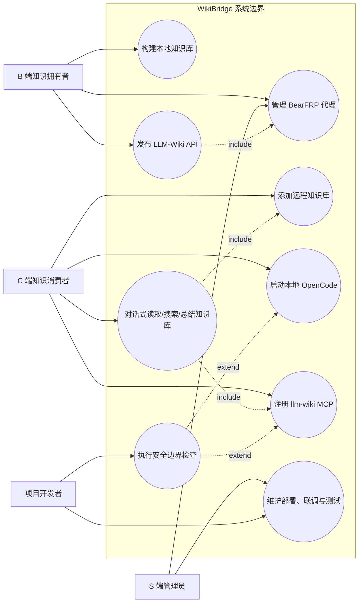
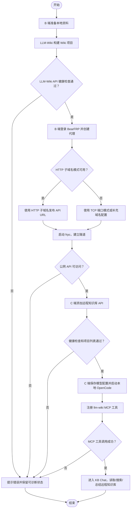

# WikiBridge 软件需求规格说明书

## 封面信息

| 项目 | 内容 |
| --- | --- |
| 文档编号 | WikiBridge-SRS-1.0 |
| 项目名称 | WikiBridge 零代码本地知识库 API 分享与 OpenCode/MCP 消费平台 |
| 项目代号 | WikiBridge |
| 文档类型 | 软件需求规格说明书 |
| 文档版本 | V1.0 |
| 架构基线 | V1.1：B 端发布 LLM-Wiki API，S 端提供 BearFRP/frps，C 端本地 OpenCode + MCP |
| 编写日期 | 2026 年 6 月 26 日 |
| 项目周期 | 2026 年 6 月课程设计阶段 |
| 编写单位 | WikiBridge 项目组（武汉大学软件工程课程设计项目组） |
| 适用阶段 | 课程设计原型、需求评审、系统验收与后续维护 |

## 文档变更历史记录

| 序号 | 变更日期 | 变更人员 | 版本 | 变更内容详情描述 |
| --- | --- | --- | --- | --- |
| 1 | 2026 年 6 月 1 日 | 项目组 | V0.1 | 启动需求调研，形成项目背景、用户角色、本地知识库分享场景和初始范围说明。 |
| 2 | 2026 年 6 月 10 日 | 项目组 | V0.2 | 完善 B 端、S 端、C 端职责划分，整理核心功能范围、边界约束和非功能需求初稿。 |
| 3 | 2026 年 6 月 18 日 | 项目组 | V0.3 | 完善顶层用例、功能需求编号、异常流程和验收口径，形成需求规格说明书主体结构。 |
| 4 | 2026 年 6 月 25 日 | 项目组 | V0.9 | 根据联调结论调整 MCP 架构：淘汰“B 端发布完整 OpenCode”方案，确立“B 端发布 LLM-Wiki API，C 端本地 OpenCode + MCP 消费远程知识库”需求基线。 |
| 5 | 2026 年 6 月 26 日 | 项目组 | V1.0 | 对照计划书、设计说明书和测试材料完善功能需求、非功能需求、验收标准和原型演示证据，形成正式版。 |

## 目录

正式提交 PDF 前由 Markdown/Word/LaTeX 工具生成目录。本 Markdown 主文档章节如下：

- 1 引言
- 2 软件的一般性描述
- 3 软件功能需求描述
- 4 其它软件需求描述
- 5 软件原型与演示证据

## 1 引言

### 1.1 编写目的

本文档定义 WikiBridge 系统在课程设计阶段应满足的功能性需求、非功能性需求、运行边界和验收口径。它的目的包括：

1. 在项目组、课程指导教师、评审人员、测试人员和后续维护者之间建立统一需求基线。
2. 明确 B 端、S 端、C 端三类环境的职责划分，避免把实现方案误解为用户需求。
3. 为软件设计说明书、测试文档、演示脚本和最终验收提供可追踪依据。
4. 记录架构需求演进：旧方案“B 端发布完整 OpenCode”因模型配置归属不清和 Agent 能力暴露风险被淘汰；当前需求基线要求 B 端只发布 LLM-Wiki API，C 端本地运行 OpenCode 并通过 MCP 消费远程知识库。

本文档描述“系统应当做什么”和“验收时如何判断完成”，不展开类设计、详细部署拓扑、内部时序和数据库实现细节。上述设计内容以《WikiBridge 软件设计规格说明书》为准。

### 1.2 读者对象

本文档主要面向：

- 武汉大学软件工程课程指导教师、答辩评审人员和项目验收方。
- WikiBridge 项目组成员，包括需求、设计、开发、测试、部署和文档负责人。
- 后续维护者，用于理解系统边界、核心功能和安全约束。
- 演示与测试人员，用于准备端到端联调、截图证据和验收材料。

### 1.3 软件项目概述

WikiBridge 是一个本地优先的知识库生成、API 分享和受控 Agent 化消费平台。项目面向学生、教师、研究者和小团队，解决本地资料难以结构化沉淀、AI 知识库部署门槛高、本地知识库难以有限分享、Agent 能力公网暴露边界不清等问题。

系统将知识库生成、发布和消费拆分为三个环境：

- B 端：知识库拥有者/发布者所在环境，保存本地资料、Wiki 内容和 LLM-Wiki API。
- S 端：公网服务器端，运行 BearFRP 控制面和 frps，负责账号、代理、隧道和公网入口。
- C 端：知识消费者所在环境，本地运行 WikiBridge Desktop、OpenCode 和 llm-wiki MCP server，保存自己的模型供应商、模型名和 API Key。

当前需求基线的核心业务是：B 端在本地生成 Wiki 后，通过 BearFRP/frp 发布受控 LLM-Wiki API；C 端在本地添加该远程知识库 API，启动本地 OpenCode 并注册 `llm_wiki_*` MCP 工具，以对话方式读取、搜索和总结远程知识库。

### 1.4 文档概述

本文档共五章：

1. 引言：说明编写目的、读者对象、项目概述、术语定义和参考资料。
2. 软件的一般性描述：说明产品运行环境、三端角色、假设前提、范围边界和架构演进约束。
3. 软件功能需求描述：给出用例模型、关键业务流程、功能需求编号和核心用例表。
4. 其它软件需求描述：说明性能、安全、可用性、兼容性、界面、进度、交付和验收要求。
5. 软件原型与演示证据：描述当前原型界面和已完成截图证据位置。

### 1.5 定义

| 术语 / 缩写 | 释义 |
| --- | --- |
| WikiBridge | 本项目名称，表示连接本地知识库、受控公网入口和本地 Agent 消费端的桥接平台。 |
| B 端 | 知识库拥有者/发布者所在环境，保存本地资料、Wiki 页面和 LLM-Wiki API。 |
| S 端 | 公网服务器端，运行 BearFRP 控制面、frps 和 HTTP vhost/TCP 发布入口。 |
| C 端 | 知识消费者所在环境，本地运行 WikiBridge Desktop、OpenCode 和 MCP server。 |
| LLM-Wiki | 本地知识库编译与 API 服务，提供健康检查、项目列表、文件读取、搜索、图谱等能力。 |
| OpenCode | C 端本地对话式知识消费入口，负责模型调用、KB Chat Session 和工具调用。 |
| MCP | Model Context Protocol，用于把远程 LLM-Wiki API 注册为 OpenCode 可调用工具。 |
| BearFRP | 本项目中的 frp 控制面，负责账号、代理、流量、子域名/端口和发布入口。 |
| frp / frpc / frps | 开源内网穿透工具及客户端/服务端；B 端运行 frpc，S 端运行 frps。 |
| KB 模式 | OpenCode 的知识库模式，限制文件访问、终端执行和工具能力范围。 |
| API 分享 | B 端通过 BearFRP 分享 LLM-Wiki API，而不是分享完整 OpenCode 页面。 |
| 远程知识库 | C 端保存的 B 端 LLM-Wiki API 地址、Token、项目选择和健康状态配置。 |
| SRS | Software Requirements Specification，软件需求规格说明书。 |
| FR | Functional Requirement，功能性需求。 |
| NFR | Non-Functional Requirement，非功能性需求。 |

### 1.6 参考资料

1. GB/T 8567-88《计算机软件开发文件编制指南》。
2. 课程提供的《软件需求说明书（GB856T——88）》模板。
3. `/root/SE/doc/需求规格说明书/参考.pdf`。
4. `/root/SE/doc/软件计划任务书/WikiBridge 可行性研究与项目开发计划书.md`。
5. `/root/SE/doc/软件设计说明书/软件设计说明书.pdf`。
6. `/root/SE/doc/images/architecture/architecture_comparison.md`。
7. `/root/SE/wikibridge/desktop/HANDOFF.md`。
8. `/root/SE/wikibridge/README.deploy.md`。
9. `/root/SE/wikibridge/opencode/doc/kb-mode.md`。
10. `/root/SE/wikibridge/llm_wiki/mcp-server/README.md`。
11. `/root/SE/doc/软件测试报告/test-tasks-测试命令与输出.md`。
12. `/root/SE/doc/软件测试报告/playwright-人工测试截图说明.md`。

## 2 软件的一般性描述

### 2.1 软件产品与其环境之间的关系

WikiBridge 不是单一 Web 站点，而是由 B 端本地知识库服务、S 端公网转发控制面和 C 端本地消费端共同组成的分布式原型系统。

| 系统组成部分 | 所在环境 | 与外部环境的关系 |
| --- | --- | --- |
| LLM-Wiki API | B 端 | 读取 B 端本地 Wiki 项目和文件，对外提供健康检查、项目、文件、搜索等 API。 |
| frpc | B 端 | 连接 S 端 frps，把本地 LLM-Wiki API 发布为公网 URL。 |
| BearFRP backend | S 端 | 提供用户、代理、端口/子域名、脚本生成和状态管理 API。 |
| frps / HTTP vhost / TCP 入口 | S 端 | 接收 B 端 frpc 连接，并把 C 端请求转发到 B 端 LLM-Wiki API。 |
| WikiBridge Desktop | B 端 / C 端 | 提供本地操作界面，覆盖发布 API、添加远程知识库、启动 OpenCode 和注册 MCP 等任务。 |
| OpenCode | C 端 | 本地运行，使用 C 端模型配置生成回答，并通过 MCP 工具访问远程知识库。 |
| llm-wiki MCP server | C 端 | 将 OpenCode 工具调用转换为远程 LLM-Wiki API 请求。 |
| 模型供应商 API | C 端外部依赖 | C 端用户自行配置模型供应商、模型名和 API Key；B 端和 S 端不得代持该配置。 |
| Docker Compose / CI / 测试脚本 | 开发与演示环境 | 支撑课程阶段部署、联调、黑盒检查和回归测试。 |

### 2.2 三端角色与职责

| 角色 | 主要职责 | 不承担的职责 |
| --- | --- | --- |
| B 端知识拥有者 | 导入本地资料，构建 Wiki，确认 LLM-Wiki API 可用，创建 BearFRP 发布入口，向 C 端分享 API URL。 | 不向外部访客暴露完整 OpenCode，不保存 C 端模型 API Key，不运行 C 端访客的 Agent 行为。 |
| S 端管理员 | 维护 BearFRP、frps、端口/子域名、账号、隧道状态、基础鉴权和异常回收。 | 不保存原始资料、Wiki 正文、向量索引、问答上下文或 C 端模型配置。 |
| C 端知识消费者 | 添加 B 端分享的远程知识库 API，本地保存模型配置，启动 OpenCode，注册 MCP 并进行对话式知识消费。 | 不获得 B 端本机权限，不访问 B 端未分享文件，不修改 B 端知识库内容。 |
| 项目开发者 | 实现与维护 LLM-Wiki、BearFRP、Desktop、OpenCode KB 模式、MCP server、部署脚本和测试脚本。 | 不在需求文档中替代用户做未确认的功能扩展承诺。 |

### 2.3 假设与前提条件

1. B 端用户已准备待构建的本地资料，并同意由 LLM-Wiki 在本机生成 Wiki 项目、页面和索引。
2. B 端运行环境允许启动 LLM-Wiki API 和 frpc；S 端公网服务器可运行 BearFRP backend 与 frps。
3. C 端用户可运行 WikiBridge Desktop、OpenCode 和 MCP server，并自行持有模型供应商 API Key。
4. B 端与 C 端之间的访问依赖 S 端 frp 隧道；HTTP 子域名模式依赖真实可解析通配域名，无法满足时可使用 TCP 端口模式。
5. 当前课程阶段以端到端原型和可验证链路为目标，不承诺商业级多租户 SLA、长期运营、真实支付、完整企业权限体系和移动端原生应用。
6. 当前课程阶段以 2026 年 6 月 26 日形成的 V1.0 文档、测试报告和截图证据作为验收基线。

### 2.4 产品范围边界

#### 2.4.1 范围内

- 本地资料导入、Wiki 构建和项目/文件维护。
- LLM-Wiki API 健康检查、项目列表、文件列表、文件内容读取、搜索和必要元数据能力。
- BearFRP 用户、代理、子域名/端口、frpc 脚本和隧道状态管理。
- B 端通过 BearFRP 发布 LLM-Wiki API。
- C 端添加远程知识库 API、检测健康状态、选择项目和保存 Token。
- C 端本地启动 OpenCode，并注册 `llm_wiki_*` MCP 工具。
- OpenCode KB 模式下对远程知识库进行只读、受控、对话式访问。
- Docker Compose 演示、健康检查、测试脚本和验收截图证据。

#### 2.4.2 范围外

- 面向全网公开的博客、CDN 分发、搜索引擎收录和长期内容托管。
- S 端云端保存用户原始资料、Wiki 正文、向量库或问答上下文。
- 将 B 端完整 OpenCode、终端、文件系统或任意 Agent 工具暴露到公网。
- 真实支付、商业订阅、企业级权限审计、内容审核平台和大规模多租户运营。
- 移动端原生 App。
- 对任意第三方 MCP 工具的公网开放。

### 2.5 架构需求演进

| 方案 | 描述 | 需求结论 |
| --- | --- | --- |
| 旧方案：B 端发布完整 OpenCode | B 端运行 LLM-Wiki 和 OpenCode，通过 frp 将完整 OpenCode 页面发布给 C 端访问。 | 淘汰。该方案会混淆模型配置归属，使 C 端访客的对话行为运行在 B 端 OpenCode 环境中，并扩大 B 端文件访问和工具调用风险。 |
| 当前方案：C 端本地 OpenCode + MCP | B 端只发布 LLM-Wiki API；C 端本地启动 OpenCode，并通过本地 MCP server 调用 B 端远程知识库 API。 | 作为本文档需求基线。B 端负责知识库生成与 API 分享，S 端负责公网转发控制面，C 端负责模型配置、Agent 和 MCP 消费。 |

## 3 软件功能需求描述

### 3.1 软件需求的用例模型

系统涉及 B 端知识拥有者、C 端知识消费者、S 端管理员和项目开发者四类参与者。顶层用例图如下：

图 3-1 WikiBridge 用户用例图

### 3.2 关键业务流程

需求层主流程只描述用户可观察业务链路，不展开内部类、线程和数据库表。

图 3-2 B 端 API 发布与 C 端 OpenCode/MCP 消费流程图

### 3.3 核心用例表

| 用例编号 | 用例名称 | 主要参与者 | 前置条件 | 成功结果 | 关联需求 |
| --- | --- | --- | --- | --- | --- |
| UC-01 | 构建本地知识库 | B 端知识拥有者 | B 端资料目录可访问，LLM-Wiki 可启动 | 本地生成可被 API 查询的 Wiki 项目和文件 | FR-01、FR-02 |
| UC-02 | 发布 LLM-Wiki API | B 端知识拥有者 | 本地 LLM-Wiki API 健康检查通过，BearFRP 可用 | 获得 C 端可访问的公网 API URL | FR-03、FR-04 |
| UC-03 | 管理 BearFRP 代理 | B 端知识拥有者、S 端管理员 | BearFRP backend 和 frps 已运行 | 代理可创建、查询、禁用并展示在线状态 | FR-04 |
| UC-04 | 添加远程知识库 | C 端知识消费者 | C 端可访问 B 端分享 URL，必要时持有 Token | C 端保存远程知识库并选择项目 | FR-05 |
| UC-05 | 启动本地 OpenCode | C 端知识消费者 | OpenCode sidecar 可用，模型配置已保存 | 本地 OpenCode 以 KB 模式运行 | FR-06、FR-09 |
| UC-06 | 注册 llm-wiki MCP | C 端知识消费者 | 远程知识库可用，MCP server 可运行 | OpenCode 可调用 `llm_wiki_*` 工具 | FR-07、FR-09 |
| UC-07 | 对话式读取/搜索/总结知识库 | C 端知识消费者 | 远程知识库、OpenCode 和 MCP 均连接成功 | 用户获得基于远程知识库内容的回答 | FR-08 |
| UC-08 | 维护部署、联调与测试 | 项目开发者、S 端管理员、测试人员 | 部署脚本、测试脚本和演示数据可用 | 形成可复现命令输出、截图和验收记录 | FR-10 |

### 3.4 功能需求概览

| 编号 | 名称 | 优先级 | 主要参与者 | 对应用例 |
| --- | --- | --- | --- | --- |
| FR-01 | 本地资料导入与 Wiki 构建 | P0 | B 端知识拥有者 | 构建本地知识库 |
| FR-02 | LLM-Wiki API 健康检查、项目、文件、搜索能力 | P0 | B 端知识拥有者、C 端知识消费者 | 构建本地知识库、添加远程知识库、对话式消费 |
| FR-03 | B 端通过 BearFRP 发布 LLM-Wiki API | P0 | B 端知识拥有者 | 发布 LLM-Wiki API |
| FR-04 | S 端代理、隧道、端口/子域名和状态管理 | P0 | S 端管理员、B 端知识拥有者 | 管理 BearFRP 代理 |
| FR-05 | C 端添加远程知识库 API | P0 | C 端知识消费者 | 添加远程知识库 |
| FR-06 | C 端本地启动 OpenCode | P0 | C 端知识消费者 | 启动本地 OpenCode |
| FR-07 | 注册并调用 `llm_wiki_*` MCP 工具 | P0 | C 端知识消费者 | 注册 llm-wiki MCP |
| FR-08 | 对话式读取、搜索和总结远程知识库 | P0 | C 端知识消费者 | 对话式读取/搜索/总结知识库 |
| FR-09 | KB 模式安全边界 | P0 | B 端知识拥有者、C 端知识消费者、项目开发者 | 执行安全边界检查 |
| FR-10 | 部署、健康检查、联调和测试支撑 | P1 | 项目开发者、S 端管理员 | 维护部署、联调与测试 |

### 3.5 软件需求的分析模型与功能需求详述

#### FR-01 本地资料导入与 Wiki 构建

| 项目 | 内容 |
| --- | --- |
| 需求描述 | 系统应支持 B 端用户把本地资料导入 LLM-Wiki，并生成可被 API 查询的 Wiki 项目、页面和索引。 |
| 参与者 | B 端知识拥有者 |
| 前置条件 | B 端资料目录存在；LLM-Wiki 可启动；用户具有本机资料访问权限。 |
| 基本流程 | 1. 用户选择或准备本地资料目录。 2. 用户触发 Wiki 构建或刷新。 3. LLM-Wiki 生成项目记录、Wiki 页面、文件列表和必要索引。 4. 用户在本地可浏览构建结果。 5. 系统通过 API 暴露项目列表和文件读取能力。 |
| 异常流程 | 1. 资料路径不存在或无权限时，系统提示路径不可访问并停止构建。 2. 构建失败时，系统保留错误日志和可重试入口。 3. 模型或构建配置缺失时，系统提示补充配置或使用已有静态资料降级验证。 |
| 后置条件 | B 端本地存在可被 LLM-Wiki API 识别的项目、Wiki 文件和索引。 |
| 验收标准 | 至少一个演示项目可通过项目列表接口查询；至少一个 Markdown 文件可通过文件内容接口读取；构建失败时不破坏已有项目数据。 |
| 关联证据 | `test-tasks-测试命令与输出.md` 中 `sample-wiki` fixture 准备；T-02/T-07 黑盒项目级检查。 |

#### FR-02 LLM-Wiki API 健康检查、项目、文件、搜索能力

| 项目 | 内容 |
| --- | --- |
| 需求描述 | LLM-Wiki 应提供供 B 端发布和 C 端消费的受控 HTTP API，至少覆盖健康检查、项目列表、文件列表、文件内容读取和搜索能力。 |
| 参与者 | B 端知识拥有者、C 端知识消费者、llm-wiki MCP server |
| 前置条件 | LLM-Wiki API 已启动；目标项目已构建；如启用 Token，则调用方持有有效 Token。 |
| 基本流程 | 1. 调用健康检查接口确认服务可用。 2. 调用项目列表接口获取可访问项目。 3. 调用文件列表接口获取项目内 Wiki 文件。 4. 调用文件内容接口读取允许路径内的文本内容。 5. 调用搜索接口按关键词或语义检索项目内容。 |
| 异常流程 | 1. API 未启动时返回连接失败或健康检查失败。 2. Token 缺失或错误时返回 401/403。 3. 项目不存在、文件不存在或路径越权时返回明确错误，不泄露本机其它路径。 4. 搜索无结果时返回空结果和友好提示，不视为系统错误。 |
| 后置条件 | C 端可基于 API 响应展示项目状态、文件内容和搜索结果。 |
| 验收标准 | `/api/v1/health`、项目列表、项目文件、文件内容和搜索请求在演示数据下返回成功状态；非法 Token 和非法路径被拒绝；API 错误包含可诊断信息但不包含敏感信息。 |
| 关联证据 | T-02 LLM Wiki API、T-07 end-to-end access、T-07 file content/search screenshots。 |

#### FR-03 B 端通过 BearFRP 发布 LLM-Wiki API

| 项目 | 内容 |
| --- | --- |
| 需求描述 | 系统应允许 B 端用户通过 BearFRP 把本地 LLM-Wiki API 发布为 C 端可访问的公网 API URL。 |
| 参与者 | B 端知识拥有者 |
| 前置条件 | B 端 LLM-Wiki API 健康检查通过；B 端可连接 S 端 frps；BearFRP 账号和代理创建能力可用。 |
| 基本流程 | 1. 用户在 B 端确认本地 LLM-Wiki API 地址和端口。 2. 用户登录或连接 BearFRP 控制面。 3. 用户选择 HTTP 子域名模式或 TCP 端口模式。 4. 系统创建代理并生成 frpc 配置或启动脚本。 5. B 端启动 frpc 建立隧道。 6. 系统返回可分享的公网 LLM-Wiki API URL。 |
| 异常流程 | 1. 本地 API 不可达时禁止发布并提示先修复 LLM-Wiki。 2. HTTP 通配域名未配置时提示切换 TCP 模式或补充域名。 3. 端口冲突、余额不足、配额不足或认证失败时，控制面返回明确原因。 4. frpc 断开时，系统显示离线状态并允许用户重试。 |
| 后置条件 | C 端可通过公网 URL 访问 B 端 LLM-Wiki API；B 端可关闭或回收该入口。 |
| 验收标准 | 公网 URL 的健康检查和项目列表可访问；发布入口指向 LLM-Wiki API，不指向 B 端完整 OpenCode；关闭代理后公网入口不可继续访问。 |
| 关联证据 | T-07 BearFRP published entry；T-06 auto-publish sidecar；`desktop/HANDOFF.md` 联调流程。 |

#### FR-04 S 端代理、隧道、端口/子域名和状态管理

| 项目 | 内容 |
| --- | --- |
| 需求描述 | S 端应提供 BearFRP 控制面和 frps 转发能力，用于管理用户、代理、子域名/端口、frpc 配置、在线状态和基础资源约束。 |
| 参与者 | S 端管理员、B 端知识拥有者 |
| 前置条件 | S 端公网服务器可运行 BearFRP backend、frps 和控制面数据库；端口和域名配置已准备。 |
| 基本流程 | 1. 管理员启动 BearFRP backend 和 frps。 2. B 端用户创建 HTTP 或 TCP 代理。 3. 系统分配子域名或公网端口，生成 frpc 连接参数。 4. frps 接收 frpc 连接并转发 C 端请求。 5. 控制面展示代理在线状态、连接时间、流量或连接数量。 6. 管理员可禁用异常代理或调整端口/子域名配置。 |
| 异常流程 | 1. 子域名已占用或端口冲突时，系统拒绝创建并提示更换。 2. frps token 不匹配时，连接被拒绝并记录状态。 3. 代理离线或心跳超时时，控制面标记离线。 4. 资源超过限制时，系统应限流、拒绝新连接或提示升级配置。 |
| 后置条件 | S 端只保存账号、代理和隧道状态，不保存知识正文和问答上下文。 |
| 验收标准 | BearFRP API 可创建和查询代理；在线状态可观测；HTTP/TCP 模式至少一种可完成演示；管理员可停止异常代理。 |
| 关联证据 | T-04 BearFRP user/proxy pytest；T-05 frps plugin and poller pytest；`README.deploy.md` BearFRP 发布说明。 |

#### FR-05 C 端添加远程知识库 API

| 项目 | 内容 |
| --- | --- |
| 需求描述 | C 端用户应能在 WikiBridge Desktop 中添加 B 端分享的 LLM-Wiki API 地址，并完成健康检查、项目读取、Token 保存和项目选择。 |
| 参与者 | C 端知识消费者 |
| 前置条件 | C 端可访问 B 端分享的公网 API URL；如 API 开启鉴权，用户持有 Token。 |
| 基本流程 | 1. 用户在“添加远程知识库”界面输入 API URL、名称和可选 Token。 2. 系统规范化 URL，并调用健康检查接口。 3. 系统调用项目列表接口。 4. 用户选择一个项目作为当前知识库。 5. 系统在 C 端本地保存远程知识库配置和最近检测状态。 |
| 异常流程 | 1. URL 格式错误时，界面提示修正。 2. 网络超时、DNS 失败或隧道离线时，系统提示远程不可达。 3. 401/403 时提示检查 Token。 4. 项目列表为空时，提示 B 端先构建或选择可分享项目。 |
| 后置条件 | C 端远程知识库列表中出现该 API，并显示健康状态、当前项目和连接入口。 |
| 验收标准 | C 端可保存、检测、切换和删除远程知识库；错误状态不会污染已有可用配置；Token 不以明文完整形式展示在日志和界面中。 |
| 关联证据 | T-07 local entry OpenCode KB home；T-09 desktop project dashboard/compile/link screenshots。 |

#### FR-06 C 端本地启动 OpenCode

| 项目 | 内容 |
| --- | --- |
| 需求描述 | C 端应在本机启动 OpenCode，并以 KB 模式作为远程知识库对话入口。 |
| 参与者 | C 端知识消费者 |
| 前置条件 | C 端已安装或打包 OpenCode sidecar；用户已保存模型供应商、模型名和 API Key；至少一个远程知识库可用。 |
| 基本流程 | 1. 用户保存或确认 C 端模型配置。 2. 用户点击连接远程知识库或启动 OpenCode。 3. Desktop 启动本地 OpenCode 进程。 4. OpenCode 以 KB 模式提供本地 Web 入口和健康检查。 5. 用户进入 KB Chat Session。 |
| 异常流程 | 1. OpenCode 二进制缺失或版本过旧时提示重新准备 sidecar。 2. 端口被占用时提示更换端口或停止旧进程。 3. 模型配置缺失时禁止进入正式问答并提示补充配置。 4. OpenCode 启动后健康检查失败时，显示日志入口和重试按钮。 |
| 后置条件 | C 端本地 OpenCode 可访问，页面标识 KB 模式，模型配置保存在 C 端。 |
| 验收标准 | 本地 OpenCode 健康检查成功；页面含 KB 模式标记；C 端模型 API Key 不上传至 B 端或 S 端。 |
| 关联证据 | T-03 KB mode meta and UI；T-07 local entry OpenCode KB home；`opencode/doc/kb-mode.md`。 |

#### FR-07 注册并调用 `llm_wiki_*` MCP 工具

| 项目 | 内容 |
| --- | --- |
| 需求描述 | C 端应把远程 LLM-Wiki API 注册为 OpenCode 可调用的 MCP 工具，并限制在 `llm_wiki_*` 知识库工具范围内。 |
| 参与者 | C 端知识消费者、OpenCode、llm-wiki MCP server |
| 前置条件 | C 端 OpenCode 已启动；远程知识库配置可用；MCP server 可运行；如远程 API 需要 Token，Token 已保存。 |
| 基本流程 | 1. Desktop 根据远程知识库生成 MCP server 配置。 2. 系统通过环境变量传入 API base URL 和 Token。 3. OpenCode 注册 llm-wiki MCP。 4. MCP server 暴露状态、项目、文件、读取、搜索和图谱等允许工具。 5. OpenCode 在对话中调用 `llm_wiki_status`、`llm_wiki_projects`、`llm_wiki_read_file`、`llm_wiki_search` 等工具。 |
| 异常流程 | 1. MCP server 启动失败时提示检查 Node 版本、入口文件和依赖。 2. 远程 API 不可达时工具返回可读错误和 Desktop 修复提示。 3. 非 JSON 响应、API 错误和网络错误应被包装为可诊断工具错误。 4. 非白名单 MCP 或本地命令型 MCP 不得在 KB 模式下被任意添加。 |
| 后置条件 | OpenCode 可以通过 MCP 访问远程知识库，但不能越过 LLM-Wiki API 直接扫描 B 端文件系统。 |
| 验收标准 | MCP 测试通过；工具调用携带必要 Token；文件读取和搜索结果来自远程 LLM-Wiki API；非法 MCP 添加或危险工具调用被拒绝。 |
| 关联证据 | T-02 LLM Wiki MCP tests；`llm_wiki/mcp-server/README.md`；T-03 KB permission tests。 |

#### FR-08 对话式读取、搜索和总结远程知识库

| 项目 | 内容 |
| --- | --- |
| 需求描述 | C 端用户应能在本地 OpenCode 中用自然语言读取、搜索和总结 B 端分享的远程知识库。 |
| 参与者 | C 端知识消费者 |
| 前置条件 | FR-05、FR-06、FR-07 已完成；C 端模型配置有效；远程知识库中存在可读内容。 |
| 基本流程 | 1. 用户在 KB Chat 中输入问题，例如要求读取某个 Markdown 文件或搜索关键词。 2. OpenCode 根据问题选择 `llm_wiki_*` 工具。 3. MCP server 请求远程 LLM-Wiki API。 4. LLM-Wiki 返回文件内容、搜索结果或项目元数据。 5. OpenCode 使用 C 端模型配置生成回答、摘要或引用说明。 |
| 异常流程 | 1. 未选择项目时，系统提示先选择远程知识库项目。 2. 文件不存在或路径不允许时，工具返回明确错误。 3. 内容过长时，工具可返回截断标记并提示分段读取。 4. 模型调用失败时，保留工具结果并提示用户检查 C 端模型配置。 |
| 后置条件 | 用户获得基于远程知识库内容的回答；B 端只暴露受控 API 响应。 |
| 验收标准 | C 端能完成至少一次文件读取、一次搜索和一次总结演示；回答不得要求 B 端执行终端命令或访问未分享路径。 |
| 关联证据 | T-07 llm-wiki-file-content；T-07 llm-wiki-search-results；T-09 desktop local wiki reader。 |

#### FR-09 KB 模式安全边界

| 项目 | 内容 |
| --- | --- |
| 需求描述 | 系统必须在需求层明确 KB 模式安全边界：B 端不得暴露完整 OpenCode；C 端 OpenCode 只能通过受控 `llm_wiki_*` MCP 工具访问远程知识库；终端、本地命令、越权文件访问和非白名单 MCP 应被阻断。 |
| 参与者 | B 端知识拥有者、C 端知识消费者、项目开发者、测试人员 |
| 前置条件 | C 端 OpenCode 以 KB 模式运行；远程知识库通过 LLM-Wiki API 接入；安全测试脚本可执行。 |
| 基本流程 | 1. 系统在 OpenCode 页面注入 KB 模式标识。 2. 文件访问限制在允许的知识库路径或远程 API 结果内。 3. 公开 Wiki 或远程知识库内容按只读方式消费。 4. Shell、PTY、终端、配置修改、动态 MCP 添加和危险权限在 KB 模式下被拒绝或隐藏。 5. 日志隐藏 Token、API Key 和敏感路径。 |
| 异常流程 | 1. 用户直接调用受限 API 时返回 403 或等价拒绝结果。 2. 用户尝试路径穿越、绝对路径、软链接逃逸或其它用户目录访问时被拒绝。 3. 旧 sidecar 或旧脚本试图发布 B 端 OpenCode 时，应被视为不符合当前需求基线。 |
| 后置条件 | C 端可以对话式消费知识库，但不能获得 B 端 Agent、本地命令或越权文件访问能力。 |
| 验收标准 | KB 模式 meta 可检测；终端/PTY/配置/MCP 动态添加等高危接口被拒绝；B 端发布入口指向 LLM-Wiki API；安全测试和 XSS 检查通过。 |
| 关联证据 | T-03 KB mode meta and UI；T-08 XSS no alert；`opencode/doc/kb-mode.md` 已验证项。 |

#### FR-10 部署、健康检查、联调和测试支撑

| 项目 | 内容 |
| --- | --- |
| 需求描述 | 项目应提供可复现的部署、健康检查、联调和测试支撑，使需求验收不依赖口头说明。 |
| 参与者 | 项目开发者、S 端管理员、测试人员 |
| 前置条件 | 代码仓库、Docker、Node、Rust/Cargo、测试脚本和演示数据按文档准备；部分测试需要 Node 20.19+。 |
| 基本流程 | 1. 使用 Docker Compose 或本地开发命令启动 LLM-Wiki、BearFRP、OpenCode 和必要网关。 2. 准备 `sample-wiki` 或等价演示数据。 3. 执行 LLM-Wiki API、BearFRP、OpenCode KB、MCP 和 Desktop 相关测试。 4. 记录命令输出、截图证据和剩余风险。 5. 将测试结果与 FR 编号关联。 |
| 异常流程 | 1. Node 版本不足时，脚本应提示所需运行时版本并终止对应自动化路径。 2. Docker 或服务未启动时，黑盒检查应失败并说明不可达组件。 3. 真实 UI 截图采集失败时，应保留错误日志并重新执行截图脚本生成证据。 |
| 后置条件 | 项目组能够用命令、截图和报告证明核心链路可运行。 |
| 验收标准 | 测试脚本语法检查和空白检查通过；T-02/T-07 黑盒项目级检查通过；T-06 sidecar 检查通过；T-09 合同测试、Playwright 测试和截图采集通过。 |
| 关联证据 | `test-tasks-测试命令与输出.md`；`playwright-人工测试截图说明.md`；`scripts/test-tasks.md`。 |

### 3.6 需求追踪矩阵

| 需求编号 | 关联用例 | 关联测试/证据 | 备注 |
| --- | --- | --- | --- |
| FR-01 | 构建本地知识库 | `sample-wiki` fixture；T-02/T-07 | 演示数据规模以测试报告记录为准。 |
| FR-02 | API 健康、项目、文件、搜索 | T-02；T-07；文件/搜索截图 | API token 策略以实际配置为准。 |
| FR-03 | 发布 LLM-Wiki API | T-06；T-07 BearFRP 发布入口 | 不再发布完整 OpenCode。 |
| FR-04 | BearFRP 代理管理 | T-04；T-05；部署说明 | HTTP 子域名依赖通配域名。 |
| FR-05 | 添加远程知识库 | T-09 Desktop 截图；HANDOFF 联调流程 | Desktop 截图编号见第 5 章。 |
| FR-06 | 启动本地 OpenCode | T-03；T-07 local entry | Node/sidecar 版本需满足打包要求。 |
| FR-07 | MCP 注册和工具调用 | T-02 MCP tests；T-03 | 工具命名采用 `llm_wiki_*`。 |
| FR-08 | 对话式消费 | T-07 文件/搜索截图；T-09 local wiki reader | 模型调用效果受 C 端模型配置影响。 |
| FR-09 | KB 安全边界 | T-03；T-08；KB mode 文档 | 旧脚本只作为历史资料，不作为当前需求。 |
| FR-10 | 部署与测试支撑 | test-tasks 输出；Playwright 截图说明 | Node 22 补跑结果和截图证据已纳入测试报告。 |

## 4 其它软件需求描述

### 4.1 性能要求

| 编号 | 要求 |
| --- | --- |
| NFR-PERF-01 | 在课程演示数据规模下，LLM-Wiki 健康检查、项目列表和文件列表应在可交互时间内返回；本地 P95 响应时间目标不超过 2 秒。 |
| NFR-PERF-02 | 通过 BearFRP/frp 访问远程 LLM-Wiki API 时，系统应尽量保持问答前工具调用可用；网络抖动时应返回超时提示，不应导致 Desktop 或 OpenCode 无响应。 |
| NFR-PERF-03 | C 端启动 OpenCode 和注册 MCP 的过程应给出进度或状态反馈；演示环境启动时间目标不超过 30 秒。 |
| NFR-PERF-04 | 搜索和文件读取结果过大时，API 或 MCP 工具应支持截断、分页或限制返回，避免单次工具调用阻塞对话。 |

### 4.2 安全与隐私要求

| 编号 | 要求 |
| --- | --- |
| NFR-SEC-01 | B 端对外只发布 LLM-Wiki API，不发布完整 OpenCode 页面、终端、文件系统或 Agent 执行环境。 |
| NFR-SEC-02 | S 端只保存账号、代理、端口/子域名、隧道状态等控制面数据，不保存原始资料、Wiki 正文、向量索引和问答上下文。 |
| NFR-SEC-03 | C 端模型供应商、模型名和 API Key 只保存在 C 端本地，不上传给 B 端或 S 端。 |
| NFR-SEC-04 | Token、API Key、密码和 frps/frpc 鉴权信息不得以明文完整形式出现在日志、截图和普通界面中。 |
| NFR-SEC-05 | KB 模式必须拒绝终端执行、PTY 创建或连接、越权文件读取、配置修改和非白名单 MCP 动态添加。 |
| NFR-SEC-06 | 文件读取必须通过 LLM-Wiki API 或 KB 模式允许路径进行，路径穿越、绝对路径越权和软链接逃逸应被拒绝。 |
| NFR-SEC-07 | B 端发布入口应支持主动关闭、过期或管理员回收。滥用、异常流量或 Token 泄露时应能够停止对应代理。 |
| NFR-SEC-08 | 展示远程知识库内容时应防止脚本执行和弹窗注入；XSS 检查结果应纳入验收证据。 |

### 4.3 可用性与可靠性要求

| 编号 | 要求 |
| --- | --- |
| NFR-REL-01 | LLM-Wiki API、BearFRP 代理、frp 隧道、远程知识库、OpenCode 和 MCP 注册状态应在界面或日志中可观测。 |
| NFR-REL-02 | 任一组件不可达时，系统应指明不可达组件和建议修复动作，例如检查 Token、端口、域名、隧道或 sidecar 版本。 |
| NFR-REL-03 | 发布入口、远程知识库配置和模型配置应在可恢复范围内本地持久化；失败重试不得删除已有可用配置。 |
| NFR-REL-04 | 黑盒检查和截图脚本应在环境不满足时给出明确版本或依赖提示，不应把环境限制误判为功能失败。 |

### 4.4 兼容性与运行环境要求

| 编号 | 要求 |
| --- | --- |
| NFR-COMP-01 | WikiBridge Desktop 原型应面向主流桌面环境，课程验收阶段以 Linux 桌面环境和浏览器自动化截图为主要验证平台。 |
| NFR-COMP-02 | OpenCode、MCP server 和 Desktop 前端相关测试需要 Node 20.19+ 或 CI 中等价运行时；最终补跑环境采用 Node 22.13.1。 |
| NFR-COMP-03 | Docker Compose 演示环境应能启动 LLM-Wiki、BearFRP、OpenCode、nginx 和可选 frpc sidecar。 |
| NFR-COMP-04 | HTTP 子域名发布依赖公网域名和通配解析；未具备该条件时，系统应支持 TCP 端口模式完成演示。 |

### 4.5 界面要求

| 界面 | 需求 |
| --- | --- |
| 本地知识库/项目界面 | 展示本地项目、构建状态、文件或编译就绪状态；构建失败时给出可读错误。 |
| BearFRP 发布界面 | 展示本地 API 地址、代理类型、子域名/端口、隧道状态、公网 URL 和关闭入口。 |
| 远程知识库界面 | 支持输入 API URL、名称、Token、健康检查、项目选择、连接、删除和错误提示。 |
| 模型配置界面 | 支持 C 端填写模型供应商、模型名、API Key，并说明该配置保存在 C 端。 |
| OpenCode 入口界面 | 展示本地 OpenCode 启动状态、KB 模式状态、进入对话入口和运行日志。 |
| MCP 连接界面 | 展示 MCP 注册状态、允许工具列表和失败原因。 |
| 错误与日志界面 | 错误信息应面向用户可理解，不只暴露底层堆栈；敏感信息应脱敏。 |

### 4.6 进度要求

| 项目 | 要求 |
| --- | --- |
| 课程阶段主链路 | 优先完成 B 端 LLM-Wiki API 发布、C 端远程知识库添加、OpenCode 启动、MCP 注册和对话式读取/搜索。 |
| 文档交付 | 需求规格说明书、软件设计说明书、测试报告、计划任务书和个人总结材料应保持术语一致。 |
| 最终交付基线 | 2026 年 6 月 26 日形成 V1.0 需求、设计和测试材料；T-09 Desktop 截图与 Node 22 补跑结果纳入最终验收证据。 |

### 4.7 交付要求

| 类型 | 交付物 |
| --- | --- |
| 程序 | WikiBridge Desktop、LLM-Wiki API、BearFRP/frps 集成、OpenCode KB 模式、llm-wiki MCP server、Docker Compose 和测试脚本。 |
| 文档 | 本需求规格说明书、计划任务书、软件设计说明书、测试文档/测试报告、部署说明、Desktop 交接说明和演示说明。 |
| 证据 | 测试命令输出、Playwright 截图、API 证据页、架构演进说明和最终答辩截图。 |

### 4.8 验收要求

1. 文档验收：本文档应覆盖 GB/T 8567-88 和课程参考 SRS 的核心章节，包括引言、一般性描述、功能需求、其它需求和软件原型。
2. 功能验收：FR-01 至 FR-10 每项均应具备参与者、前置条件、基本流程、异常流程和验收标准。
3. 链路验收：B 端构建 Wiki、发布 LLM-Wiki API，C 端添加远程知识库、本地启动 OpenCode、注册 MCP，并完成读取/搜索/总结演示。
4. 安全验收：不得通过公网暴露 B 端完整 OpenCode；C 端 KB 模式应拒绝终端、本地命令、越权文件和非白名单 MCP。
5. 测试验收：以 `test-tasks-测试命令与输出.md`、测试分析报告和 CI 结果为依据，记录通过、失败和环境差异。
6. 截图验收：第 5 章列出的截图证据已按测试项编号，可用于最终提交和答辩演示。

## 5 软件原型与演示证据

### 5.1 原型界面文字描述

当前 WikiBridge 原型以桌面端工作台和本地 OpenCode KB 页面为主要入口：

- Desktop 本地知识库界面：展示项目列表、构建状态、编译就绪状态和本地 Wiki 阅读入口。该界面用于证明 B 端可以准备和检查本地知识库。
- Desktop BearFRP/访问连接界面：展示发布 API、代理状态、公网 URL 和联调错误。该界面用于证明 B 端分享的是 LLM-Wiki API。
- Desktop 远程知识库界面：允许 C 端粘贴 B 端分享地址、填写 Token、执行健康检查、读取项目列表并连接远程知识库。
- Desktop OpenCode 面板：负责启动本地 OpenCode，显示运行状态，并进入 KB Chat。
- OpenCode KB 页面：页面带有 KB 模式标识，隐藏或拒绝终端、危险文件访问和动态 MCP 等能力，作为 C 端对话式消费入口。
- API 证据页：当真实 UI 截图受环境限制时，可使用同源 API 返回数据生成证据页，证明文件内容读取、搜索结果和安全检查通过。

### 5.2 已完成截图证据

| 测试项 | 截图文件 | 当前结果 | 证据来源 | 对应需求 |
| --- | --- | --- | --- | --- |
| T-07 | `/root/SE/doc/软件测试报告/screen-shot/T-07-local-entry-opencode-kb-home.png` | PASS | real-ui | FR-06、FR-09 |
| T-03 | `/root/SE/doc/软件测试报告/screen-shot/T-03-kb-mode-meta-and-ui.png` | PASS | real-ui | FR-06、FR-09 |
| T-07 | `/root/SE/doc/软件测试报告/screen-shot/T-07-llm-wiki-knowledge-base-page.png` | PASS | api-evidence | FR-01、FR-02 |
| T-07 | `/root/SE/doc/软件测试报告/screen-shot/T-07-llm-wiki-file-content.png` | PASS | api-evidence | FR-02、FR-08 |
| T-07 | `/root/SE/doc/软件测试报告/screen-shot/T-07-llm-wiki-search-results.png` | PASS | api-evidence | FR-02、FR-08 |
| T-08 | `/root/SE/doc/软件测试报告/screen-shot/T-08-xss-no-alert-llm-wiki-content.png` | PASS | api-evidence | FR-09 |
| T-07 | `/root/SE/doc/软件测试报告/screen-shot/T-07-bearfrp-published-entry.png` | PASS | real-ui | FR-03、FR-04 |
| T-09 | `/root/SE/doc/软件测试报告/screen-shot/T-09-desktop-project-dashboard.png` | PASS | real-ui | FR-01、FR-05 |
| T-09 | `/root/SE/doc/软件测试报告/screen-shot/T-09-desktop-compile-ready.png` | PASS | real-ui | FR-01 |
| T-09 | `/root/SE/doc/软件测试报告/screen-shot/T-09-desktop-link-report-ready.png` | PASS | real-ui | FR-03、FR-05 |
| T-09 | `/root/SE/doc/软件测试报告/screen-shot/T-09-desktop-local-wiki-reader.png` | PASS | real-ui | FR-01、FR-08 |

### 5.3 演示脚本

1. B 端启动 LLM-Wiki，并确认 `/api/v1/health` 和项目列表可访问。
2. B 端通过 BearFRP 创建代理，获得公网 LLM-Wiki API URL。
3. C 端打开 WikiBridge Desktop，保存自己的模型配置。
4. C 端在远程知识库界面粘贴公网 API URL，执行健康检查并选择项目。
5. C 端连接该远程知识库，Desktop 启动本地 OpenCode 并注册 llm-wiki MCP。
6. C 端在 KB Chat 中提问，例如“读取知识库里的 overview.md 并总结主要内容”或“搜索 WikiBridge 相关内容”。
7. 演示安全边界：确认页面处于 KB 模式，终端/PTY/动态 MCP 等高危能力不可用，B 端没有向公网暴露完整 OpenCode。
